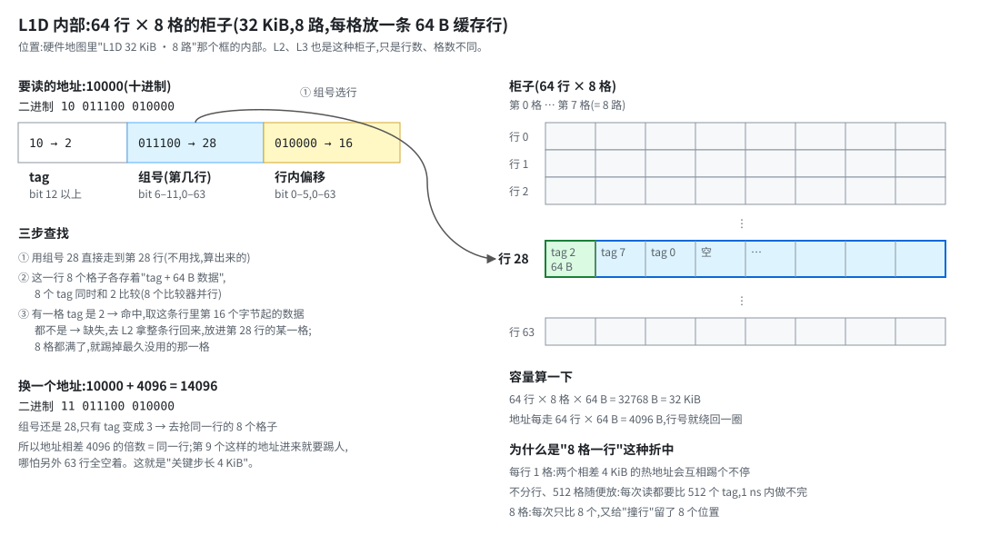

# 内存对齐与典型内存布局优化 —— 地址和邻居,决定一次访问要碰几条缓存行

> 源笔记:[`11-内存对齐与典型内存布局优化.md`](../../trading-system-notes/chinese/01-low-latency/11-内存对齐与典型内存布局优化.md)(631 行,🔴)
>
> **状态(2026-10-02):轮 1(对齐的机制、`alignas`、堆上的对齐、`AlignedAllocator`、`#pragma pack`)已讲、检验已批(见附一);轮 2(AoS/SoA、代理视图、去规范化、字段顺序与 `alignas(64)`、字符数组 vs 指针、函数分组)已讲、检验已批(见附二);轮 3(组相联与关键步长、存储类别、DRAM 行缓冲与刷新、多通道均衡)已讲,检验待回(3 题,各带追问)。**
>
> **读法**:讲到哪段代码,代码就贴在那一节里(标源行号,只作出处);不用点链接去翻源笔记。源笔记里个别写错的地方,下面直接写正确版本。
>
> **轮次安排**:轮 1 = 源 :1-202(对齐 API 演示 + `AlignedAllocator`);轮 2 = :205-532(布局优化:AoS/SoA、去规范化、按访问频率排字段、字符数组 vs 指针、函数分组);轮 3 = :535-628(缓存与内存硬件的几何:关键步长、bank 冲突、存储类别、channel/rank/bank 与填充公式)。
>
> 数字来源:布局、偏移、取整、崩溃都来自 [11-alignment-check.cpp](11-alignment-check.cpp)(g++ 16.2.0,MinGW-w64 UCRT,Windows 10,x86-64;没有新跑基准,`static_assert` 钉住了笔记里写的每个大小和偏移)。行分裂和 split lock 的代价、THP 的行为是架构 / 内核常识,**没在本机测**(本机是 Windows,没有 Linux 运行环境)。下面逐处标了"实测""推导"或"常识"。

### 源笔记定位

| 内容 | 锚点 |
|---|---|
| 检查函数 `printAlignmentInfo` | [:10](../../trading-system-notes/chinese/01-low-latency/11-内存对齐与典型内存布局优化.md:10) |
| 默认 struct 对齐与填充 | [:25](../../trading-system-notes/chinese/01-low-latency/11-内存对齐与典型内存布局优化.md:25) |
| `alignas`(类型上 · 变量上) | [:38](../../trading-system-notes/chinese/01-low-latency/11-内存对齐与典型内存布局优化.md:38) · [:45](../../trading-system-notes/chinese/01-low-latency/11-内存对齐与典型内存布局优化.md:45) |
| `std::aligned_alloc`(取整公式 :56) | [:51](../../trading-system-notes/chinese/01-low-latency/11-内存对齐与典型内存布局优化.md:51) |
| 对齐的 `new`(:79 分配 · :81 释放) | [:69](../../trading-system-notes/chinese/01-low-latency/11-内存对齐与典型内存布局优化.md:69) |
| `#pragma pack` | [:86](../../trading-system-notes/chinese/01-low-latency/11-内存对齐与典型内存布局优化.md:86) |
| `AlignedAllocator`(16 KB 门槛 :155 · 大档 :162 · `madvise` :168) | [:137](../../trading-system-notes/chinese/01-low-latency/11-内存对齐与典型内存布局优化.md:137) |
| 轮 2:AoS/SoA · 去规范化 · 访问频率布局 · 字符数组 · 函数分组 | [:205](../../trading-system-notes/chinese/01-low-latency/11-内存对齐与典型内存布局优化.md:205) · [:397](../../trading-system-notes/chinese/01-low-latency/11-内存对齐与典型内存布局优化.md:397) · [:478](../../trading-system-notes/chinese/01-low-latency/11-内存对齐与典型内存布局优化.md:478) · [:494](../../trading-system-notes/chinese/01-low-latency/11-内存对齐与典型内存布局优化.md:494) · [:526](../../trading-system-notes/chinese/01-low-latency/11-内存对齐与典型内存布局优化.md:526) |
| 轮 3:关键步长 · 存储类型 · channel/rank/bank | [:535](../../trading-system-notes/chinese/01-low-latency/11-内存对齐与典型内存布局优化.md:535) · [:560](../../trading-system-notes/chinese/01-low-latency/11-内存对齐与典型内存布局优化.md:560) · [:573](../../trading-system-notes/chinese/01-low-latency/11-内存对齐与典型内存布局优化.md:573) |

---

## 轮 1:对齐的机制

### 1. 对齐是什么,CPU 为什么在乎

**对齐**(alignment)是说:一个值的起始地址必须是某个数 N 的整数倍,叫"按 N 对齐";C++ 里 `alignof(T)` 就是类型 T 要求的那个 N。x86-64 上基本类型的对齐等于它自己的大小:`char` 是 1,`int` 是 4,`double` 和指针是 8。

CPU 在乎它,是因为**缓存行**:内存和缓存之间是按 64 字节一整条搬的([§5 轮 4](05-内存模型与缓存及流水线.md))。一个按 8 对齐的 `double`,它的起点在一条行内只可能是偏移 0、8、16……56,最后一个 56 到 63 正好塞满,**不可能横跨两条行**;`int` 按 4 对齐同理。反过来,一个 `double` 如果落在偏移 60,前 4 字节在这一条行、后 4 字节在下一条,读它就得碰两条行。(把行内所有可能的起点枚举一遍:`double` 的 8 个起点、`int` 的 16 个起点,横跨的都是 0 个,实测。)

横跨两条行有两类后果,轻重差得多:

- **轻的:变慢。** 一次 load 要拆成两次缓存访问(叫**行分裂**,line split);两条行如果还分处两个 4 KiB 页,还要多一次地址翻译。x86 不会因此崩溃,只是悄悄变慢——所以对齐问题在 x86 上很难靠"崩了"发现。(常识,没在本机测。)
- **重的:原子操作。** 原子读改写(#9 里的 `lock` 前缀指令)靠"在指令做完之前一直独占这一条缓存行"保证不被打断([5补](05-补-MESI缓存一致性状态机.md))。数据横跨两条行,一条行独占不住,CPU 只能退化成锁住整个内存总线,叫 **split lock**:代价比普通原子操作高得多,还会拖住别的核;Linux 5.7 起内核能检测并报告它(`split_lock_detect`)。(常识,没在本机测。)

还有一类是硬性要求:SIMD 的"对齐版"load/store(SSE 的 `movaps` 之类)要求地址 16 字节对齐,不满足直接崩;第 4 节 `AlignedNewObject` 里的 `alignas(16) float simd_data[4]` 就是给它准备的。向量化留给 #21。

最后要小心一个推广:"按自己的大小对齐就不跨行",只对**大小是 2 的幂、且不超过 64** 的值成立。一个 12 字节、`alignof` 为 4 的结构体,起点只要求是 4 的倍数,落在行内偏移 56 或 60 就会横跨(16 个可能的起点里有 2 个,枚举,实测);把它 `alignas(16)`、补到 16 字节,4 个可能的起点一个也不跨。所以结构体会不会跨行,看的是**它的大小**和**你给它的对齐**,不是"对齐了"三个字。

### 2. 编译器怎么做到:填充

编译器摆一个结构体的成员,规则三条:

1. 成员按声明顺序从上往下摆,每个成员放在"当前位置往后、第一个是它自己对齐的倍数"的地址,中间的空隙塞**填充字节**(padding);
2. 整个结构体的对齐 = 成员里最大的那个对齐;
3. `sizeof` 最后补到自己对齐的倍数(**尾部填充**)。

源 :25-30 的例子:

```cpp
struct DefaultAlignedStruct {
    char a;      // 1 byte
    // 3 bytes padding
    int b;       // 4 bytes
    double c;    // 8 bytes
}; // sizeof = 16, alignof = 8
```

走一遍:`a` 放偏移 0;`b` 要 4 的倍数,下一个是 4,所以 1–3 是 3 字节填充;`b` 占 4–7;`c` 要 8 的倍数,8 正好,占 8–15;结尾 16 已经是最大对齐 8 的倍数。结果 `sizeof = 16`、`alignof = 8`,偏移 0/4/8(实测)。

第 3 条为什么要有:因为**数组**。`T arr[N]` 的第 i 个元素在 `基址 + i × sizeof(T)`;如果 `sizeof` 不是 `alignof` 的倍数,第 0 个元素对齐了,第 1 个就错位了。所以 `sizeof` 永远是 `alignof` 的倍数,哪怕最后一个成员没占满。

成员的**顺序**会改变大小。例子:`{char a; double b; char c; int d;}`——`a`@0;`b` 要 8 的倍数,跳到 8(填 7 字节);`c`@16;`d` 要 4 的倍数,跳到 20(填 3 字节);结尾 24。`sizeof = 24`,其中 11 字节是填充。换成 `{double b; int d; char a; char c;}`:`b`@0,`d`@8,`a`@12,`c`@13,结尾 14,尾部补到 16,`sizeof = 16`(实测)。同样四个成员,一个 24 字节、一个 16 字节。经验:**同一个结构体里,按对齐从大到小排,填充最少。** 放进数组里就有实打实的后果:一条缓存行放得下 64 ÷ 24 ≈ 2.7 个还是 64 ÷ 16 = 4 个,扫一遍数组要碰的缓存行数差三分之一(算术推导,不是计时)。

不过这只解决"省字节"。热路径上的结构体还要问"哪些成员总是一起被访问"——那是布局优化那一半(源 §3),两个目标冲突时哪个优先,到那里再讲。

### 3. `alignas`:主动把对齐调大

`alignas(N)` 让你提出比默认更高的对齐要求。写在**类型**上和写在**变量**上,效果不一样。源 :38-45:

```cpp
struct alignas(32) AlignasType {
    int data[5]; // 5 * 4 = 20 bytes. 总大小补齐至32字节。
};

alignas(64) char buffer[100];
```

- **写在类型上**:`struct alignas(32) AlignasType { int data[5]; }`。数据只有 20 字节,但类型的对齐变成 32,`sizeof` 按上面第 3 条补到 32(实测 32/32)。这个类型的每个对象都从 32 的倍数开始、占 32 字节。
- **写在变量上**:`alignas(64) char buffer[100]`。只有这个变量的**地址**是 64 的倍数(实测偏移 0),`sizeof` 还是 100;类型 `char[100]` 自己的对齐没变(`alignof(decltype(buffer))` 是 1)。顺带:标准 C++ 的 `alignof` 只能用在类型上,`alignof(buffer)` 这种用在变量上的写法是 GCC 扩展(g++ 给 64,`-Wpedantic` 会警告,实测)。

N 取 64 最常见:对象从一条缓存行的起点开始;只要它的 `sizeof` 是 64 的倍数(64、128、192……,即整数条行;类型上写 `alignas(64)` 时编译器自动补成这样,见下面〔补〕),它就**独占**自己占的那几条行,邻居的写不会和它抢同一条——这就是 §5 轮 4 拆伪共享用的办法(那里实测慢 10–20 倍),也是 5补 里"单写者 / 多读者"规则的落地。想可移植地拿到"行大小",用 C++17 的 `std::hardware_destructive_interference_size`(`<new>`;这台机器上的 g++ 给 64,实测)。

代价:`alignas(64)` 会把一个 4 字节的计数器撑成 64 字节。**这是主动拿空间换隔离**;下一轮 §3 那个 `alignas(64)` 结构体,就是在这笔交易里做取舍。

**〔补〕"`sizeof` 是 64 的倍数"是什么意思?**(2026-09-30,用户追问:"64 倍数啥意思,比缓存行都大?")

是的,可以比一条行大。"64 的倍数"就是 64、128、192……,即**整数条缓存行**。这句话要的不是"对象大",而是"对象的**结尾**正好落在行的边界上":

- 起点靠 `alignas(64)` 落在行的边界;
- 终点靠 `sizeof` 是 64 的倍数落在行的边界。否则最后一条行只用了一部分,剩下的空位可能被后面的东西占走,两边的写就在这条行上抢起来,是伪共享。

类型上写 `alignas(64)` 时,`sizeof` 会自动补成 64 的倍数(第 2 节第 3 条规则):`struct alignas(64) { char x[100]; }` 是 128,占两整条行(实测)。所以对这种类型,"`sizeof` 是 64 的倍数"不是额外条件,编译器已经替你做了。真正要自己管的是**变量或成员上**的 `alignas(64)`——它只管起点,不改 `sizeof`:`struct { alignas(64) char a[100]; char b; }` 里 `b` 在偏移 100,和 `a` 的尾巴(第 64–99 字节)一起挤在第 1 行;给 `b` 也加 `alignas(64)`,`b` 才到偏移 128、第 2 行(实测)。

```
Two:   alignas(64) char a[100]; char b;          Big:  struct alignas(64) { char x[100]; }
行 0   a[0..63]                                   行 0   x[0..63]
行 1   a[64..99] | b@100 | 空                     行 1   x[64..99] | 28 字节填充      ← 整条行都是它的
       ↑ a 的尾巴和 b 共用这条行                   行 2   下一个对象从这里开始
```

### 4. 堆上的对齐:`malloc` 和普通 `new` 不管你要 64

栈上和全局的对象,`alignas` 一写,编译器就替你办了。堆上不一样:`malloc` 和普通 `new` 只保证对齐到"任何基本类型都能放"的程度,x86-64 上是 16(`alignof(std::max_align_t)` 和 `__STDCPP_DEFAULT_NEW_ALIGNMENT__` 都是 16,实测)。要 64 或更大,得换接口。源码给了两个。

**`std::aligned_alloc(alignment, size)`**。源 :51-65:

```cpp
const size_t alignment = 64;
const size_t requested_size = 200;

// `aligned_alloc` 要求 size 必须是 alignment 的整数倍
size_t size_to_alloc = ((requested_size + alignment - 1) / alignment) * alignment;

void* mem = std::aligned_alloc(alignment, size_to_alloc);
if (!mem) { return; }
// ...
std::free(mem);   // 用 std::free 释放
```

规则是 `size` 必须是 `alignment` 的整数倍,所以要先把请求向上取整:200 取到 64 的倍数是 256,300 是 320(实测)。不取整的后果:按现行 C 标准是分配失败、返回空指针(早期 C11 文本写的是未定义行为),所以代码里要检查 `mem` 是不是空(常识,没查标准原文)。**这台 Windows 机器上编译不了:MinGW 没有 `std::aligned_alloc`**(实测,报 `'aligned_alloc' is not a member of 'std'`)。Windows 上对应的是 `_aligned_malloc`,必须配 `_aligned_free`,不能用 `free`。所以这一段在本机"未验证"。

**对齐的 `new`**(C++17)。C++17 之前,`new T` 对 `alignas(64)` 的类型不保证对齐;C++17 起,类型自己的对齐超过默认值(16)时,`new T` 自动改走 `operator new(size_t, std::align_val_t)`,`delete p` 也自动走配套的释放函数。实测:`struct alignas(64) OverAligned` 直接 `new`,地址是 64 的倍数,普通 `delete` 正常返回。

**坑:对齐只写在 `new` 上,`delete` 不会跟着配对。** 源 :69-81 的例子:

```cpp
class AlignedNewObject {
    // ...
    alignas(16) float simd_data[4];   // 类型自己只要求 16
};

auto* obj = new (std::align_val_t{128}) AlignedNewObject();  // 分配:带对齐的版本
delete obj;                                                  // 释放:普通版本 —— 不配对
```

`new` 里显式传了 128,分配走带对齐的版本;可 `delete obj` 看的是**类型**的对齐(16,没超过默认),走的是**普通**的 `operator delete`。分配和释放不是一对,按标准是未定义行为。**实测:Windows 上(g++ 16.2.0,MinGW-w64 UCRT)这样写会崩,退出码 `0xC0000374`(堆损坏)**。正确写法是对齐写进类型,或者手动成对:

```cpp
obj->~AlignedNewObject();
::operator delete(obj, std::align_val_t{128});   // 实测正常
```

崩的原因推测是 MinGW 上带对齐的分配走 `_aligned_malloc`、普通 `delete` 走 `free`,两边不是一家(推断,没核对 libstdc++ 源码)。Linux / glibc 上是否碰巧能跑没测;别拿"碰巧能跑"当依据。

规则:**要超过类型自己的对齐,要么把对齐写进类型(`alignas(128)` 加在类上,让 `new` / `delete` 自动配对),要么 `new` 和 `delete` 都手动用带 `align_val_t` 的版本。**

### 5. `AlignedAllocator`:工业版的两档对齐

第二块代码把上面这些封装成一个 STL 分配器,核心是 `allocate`(源 :147-182):

```cpp
[[nodiscard]] T* allocate(size_t n) {
    // ...(溢出检查)
    size_t num_bytes = n * sizeof(T);
    void* ptr = nullptr;

    if (num_bytes <= (1 << 14)) { // 16KB threshold
        const size_t alignment = 64;
        size_t sz = (num_bytes + alignment - 1) & ~(alignment - 1);
        ptr = std::aligned_alloc(alignment, sz);
        if (ptr) {
            std::memset(ptr, 0, sz);
        }
    } else { // Large allocation path
        const size_t alignment = 1 << 21; // 2MB
        size_t sz = (num_bytes + alignment - 1) & ~(alignment - 1);
        ptr = std::aligned_alloc(alignment, sz);
        if (ptr) {
#if defined(__linux__)
            madvise(ptr, sz, MADV_HUGEPAGE);
#endif
            std::memset(ptr, 0, sz);
        }
    }
    if (!ptr) { throw std::bad_alloc(); }
    return static_cast<T*>(ptr);
}

void deallocate(T* p, size_t /*n*/) noexcept {
    std::free(p);
}
```

按请求大小分两档:

- **≤ 16 KB**:64 字节对齐,大小取整到 64 的倍数,清零。每次分配都从一条缓存行的起点开始、占整数条行,所以相邻两次分配出来的对象不会挤在同一条行里。
- **> 16 KB**:**2 MiB 对齐**,大小取整到 2 MiB 的倍数,Linux 上调 `madvise(ptr, sz, MADV_HUGEPAGE)`,然后清零。

取整用的是掩码写法 `(n + a - 1) & ~(a - 1)`,原理和 #9 里 `& mask` 等价于 `% size` 是同一个:`a` 是 2 的幂时,`a - 1` 的低位全是 1,`~(a - 1)` 把低位清零,等于"向下取整到 a 的倍数";先加 `a - 1` 再清,就成了向上取整。**只对 2 的幂成立**:我拿 `a = 48` 对照除法版枚举 0 到 10 万,66,672 个数结果不同(第一个是 n=1:除法版 48,掩码版 16);`a = 64` 是 0 个不同(实测)。

**为什么大块要对齐到 2 MiB。** 2 MiB 是 x86-64 大页的大小,内核的透明大页(THP)只能把"按 2 MiB 对齐、长 2 MiB"的区间映射成一个大页(内核行为,没在本机测)。起点没对齐,头尾不足一个大页的部分只能用 4 KiB 页,#7 讲的 TLB 收益就打折;整块对齐到 2 MiB,整块都有资格。

**`madvise` 为什么在 `memset` 前面。** 页是**第一次被碰**的时候才分配的,内核在那一刻看这段地址上有没有"想要大页"的标记,来决定给一个大页还是 4 KiB 页。先清零、后 advise,页已经是小页了,只能等后台线程 khugepaged 以后再合并——正是 #7 说的那种不可预测的尖刺。

清零还有一个副作用:`memset` 把每一页都碰一遍,#10 轮 2 坑 1 那笔"第一次写的缺页"(实测每页约 1.5 µs)就在这一刻付清,而不是留到热路径第一次用它的时候。

这个设计的两笔代价:

1. **大档的空间放大。** 请求 20 KiB 就进大档,`sz` 取整到 2 MiB(算出 2,097,152),`memset` 清 2 MiB,一个 20 KiB 的容器物理上占 2 MiB。16 KiB 到 2 MiB 之间的所有请求都是这样——它适合"少量大数组",不适合大量中等大小的容器(推导)。
2. **THP + `madvise` 依赖系统开关。** #7 讲过 HFT 实际用的是预留好的显式大页(`mmap(MAP_HUGETLB)`),并建议把 THP 关掉。这个分配器用的是 THP + `madvise`:分配时同步拿大页,停顿落在分配那一刻、不在热路径,但系统 THP 开关是 `never` 时 `madvise` 不起作用,拿到的是普通页(内核行为,没在本机测)。被问"分配器怎么拿大页"时要说清:显式大页更确定,THP + `madvise` 方便但依赖系统配置。

另外 `deallocate` 用 `std::free`,和 `aligned_alloc` 配对,只在 POSIX 上成立;Windows/MinGW 上没有 `std::aligned_alloc`,这份分配器编译不了。

### 6. `#pragma pack`:反过来放弃对齐

源 :86-92:

```cpp
#pragma pack(push, 1) // 设置1字节对齐
struct PackedStruct {
    char a;      // 1 byte
    int b;       // 4 bytes
    double c;    // 8 bytes
}; // sizeof = 1+4+8=13, alignof = 1
#pragma pack(pop) // 恢复默认对齐
```

`#pragma pack(push, 1)` 告诉编译器"成员之间不许塞填充,对齐降到 1":`PackedStruct { char a; int b; double c; }` 成了 13 字节,`b` 在偏移 1、`c` 在偏移 5,`alignof` 是 1(实测);默认版本是 16 字节。

它把第 1 节的好处全反过来:`b` 和 `c` 不再落在自己对齐的地址上,随结构体在行里的位置不同,随时可能横跨两条行;数组里每个元素 13 字节,起点一路漂移,总有一部分元素横跨。对 `c` 取地址得到的是没对齐的 `double*`,按标准解引用它是未定义行为;x86 硬件不崩,别的架构可能崩。**编译器对 `#pragma pack` 不提醒**:我取 `&p.b` 转 `int*`、`&p.c` 转 `double*`,`-Wall -Wextra -Wpedantic` 下没有任何警告(实测)。在这类成员上做原子操作,还可能撞上 split lock。

那它有什么用?让结构体的**字节布局和外部格式逐字节一致**——网络协议报文、文件格式。它是"描述外面世界的布局"的工具,不是"省内存"的优化手段;源代码里的注释也说"禁用填充可能影响性能且不可移植"(源 :96)。读这类数据时,常见做法是先把字段 `memcpy` 到对齐的局部变量里再用,编译器通常会把固定大小的 `memcpy` 优化成一条 load。

### 小结:三句话

1. **对齐 = 起点是大小的倍数,目的是让值不横跨缓存行**;编译器靠填充做到,成员顺序会改变 `sizeof`(同样四个成员,24 字节 vs 16 字节)。
2. `alignas` 是把对齐调大(拿空间换隔离),`#pragma pack` 是放弃对齐(换字节布局和外部格式一致)。堆上要 64 或 2 MiB 对齐,得用 `aligned_alloc` / 对齐的 `new` / 分配器:`size` 先取整,`new` 和 `delete` 要成对。
3. 大块对齐到 2 MiB 是为了让内核能给整块大页;`madvise` 必须在第一次碰这块内存之前。

### 检验题(已批,见附一)

1. **填充与重排**:`struct T { char a; double b; char c; int d; };` 在 x86-64 上,每个成员的偏移、`sizeof`、`alignof` 各是多少?把成员重排,让 `sizeof` 最小,写出顺序和大小。**追问**:为什么 `sizeof` 一定是 `alignof` 的整数倍?如果编译器只补到最后一个成员结束,会出什么事?
2. **为什么要对齐**:为什么按 8 对齐的 `double` 一定不会横跨两条缓存行?如果横跨了,有哪两类后果(一轻一重)?**追问**:一个 12 字节、`alignof` 为 4 的结构体,按自己的对齐摆放,能保证不跨行吗?要保证的话怎么改?
3. **堆上的对齐**:要一块 300 字节、64 字节对齐的缓冲区,`std::aligned_alloc(alignment, size)` 的两个参数各传什么?为什么 `size` 不能直接传 300?**追问**:`AlignedAllocator` 的大块为什么要对齐到 2 MiB?`madvise` 为什么必须在 `memset` 清零之前?

### 验证代码

[11-alignment-check.cpp](11-alignment-check.cpp)。内嵌的结构体逐字来自源笔记 :25-30、:38-40、:69-75、:86-92(标了行号);`static_assert` 钉住了笔记里写的每个大小和偏移,写错了编译不过。

```bash
g++ -std=c++20 -O1 -Wall -Wextra -Wpedantic 11-alignment-check.cpp -o 11-alignment-check
./11-alignment-check                   # 布局、枚举、取整公式、过对齐类型的 new/delete
./11-alignment-check aligned-delete    # 显式析构 + ::operator delete(obj, align_val_t{128})
./11-alignment-check plain-delete      # 源 :79/:81 的写法
```

实测环境:g++ 16.2.0(WinLibs,MinGW-w64 UCRT),Windows 10,x86-64(Ryzen 5 5600GT);编译零警告。

| 项 | 结果 |
|---|---|
| 源 :25-30 `DefaultAlignedStruct` | 偏移 0/4/8,`sizeof` 16,`alignof` 8 |
| 我的例子 `{char, double, char, int}` → 重排 `{double, int, char, char}` | 24(偏移 0/8/16/20) → 16(偏移 0/8/12/13) |
| 源 :38-40 `alignas(32)`,数据 20 B | `sizeof` 32,`alignof` 32 |
| 源 :45 `alignas(64) char buffer[100]` | 地址 % 64 = 0,`sizeof` 100,`alignof(decltype(buffer))` 1,`alignof(buffer)` 64(GCC 扩展,`-Wpedantic` 警告) |
| 源 :86-92 `PackedStruct` | 偏移 0/1/5,`sizeof` 13,`alignof` 1;取 `&p.b`、`&p.c` 转指针无警告 |
| 行内起点枚举:横跨两条行的个数 / 起点总数 | `double` 0/8,`int` 0/16,12 字节 `alignof` 4 的结构体 2/16,`alignas(16)` 补到 16 字节 0/4 |
| `alignof(max_align_t)` · 默认 `new` 对齐 · `hardware_destructive_interference_size` | 16 · 16 · 64 |
| 取整:`up_div(200,64)` · `up_mask(200,64)` · `up_mask(300,64)` | 256 · 256 · 320 |
| 掩码版 vs 除法版,n∈[0,100000] 结果不同的个数 | `a=64`:0;`a=48`:66,672(首个 n=1:48 vs 16) |
| `AlignedAllocator` 取整(源 :155-164) | 16 KiB 请求 → 小档 16,384;20 KiB 请求 → 大档 2,097,152(2.0 MiB) |
| 过对齐类型 `struct alignas(64) OverAligned` 的 `new` / 普通 `delete` | 地址 % 64 = 0,`delete` 正常 |
| 类型上 `alignas(64)`,数据 100 B(`Big`) | `sizeof` 128 = 两整条行(自动补齐) |
| 成员上 `alignas(64)`(〔补〕):`Two {alignas(64) a[100]; b}` · `Three {alignas(64) a[100]; alignas(64) b}` | `Two`:`b`@100,和 `a` 的尾巴同在第 1 行;`Three`:`b`@128,在第 2 行 |
| 源 :79-81:aligned new + 普通 `delete` | **崩,退出码 `0xC0000374`(堆损坏)** |
| 显式析构 + `::operator delete(obj, align_val_t{128})` | 正常,退出码 0 |
| `std::aligned_alloc`(源 :51-65) | **本机不存在**,编译报 `'aligned_alloc' is not a member of 'std'` |

**没验证的**:源 :51-65 的 `aligned_alloc` 演示和 `AlignedAllocator` 整体(依赖 `std::aligned_alloc`,`madvise` / THP 又是 Linux 行为);行分裂、split lock 的代价(架构常识);Linux / glibc 上 aligned new 配普通 `delete` 是否碰巧能跑。

### 附一:轮 1 检验批改(2026-10-02)

**Q1 填充与重排**:重排答对:`{char a; char c; int d; double b;}`,偏移 0/1/4/8(中间 2 字节填充),`sizeof` 16。原结构体没写,标准答案:a@0、b@8、c@16、d@20,`sizeof` 24,`alignof` 8。追问对:`sizeof` 补到最大对齐的倍数,理由是数组——第 0 个元素对齐了,后面的就错位。例:`{double; int;}` 末尾在 12,补到 16,否则 `arr[1]` 的 `double` 落在偏移 12。

**Q2 为什么要对齐**:关键句没说到:**64 是 8 的倍数**。行首都是 64 的倍数,`double` 的起点是 8 的倍数,所以行内起点只能是 0、8……56,最后一个正好撑满("最大的也是 8"不是理由)。两类后果(行分裂变慢、split lock)对。追问没答:12 字节、`alignof` 4 的结构体不能保证,行内 16 个起点里落在 56、60 的 2 个会跨行;`alignas(16)` 补到 16 字节,4 个起点都不跨。

**Q3 堆上的对齐**:参数没写:`alignment` 传 64,`size` 传 320(300 向上取整到 64 的倍数)。"不取整会报错"方向对,准确说是分配失败、返回空指针。2 MiB 对齐对。`madvise` 必须在 `memset` 之前:答得比正文还细(小页不能原地变大页,只能等 `khugepaged` 异步合并,合并时出现延迟尖刺);"CPU 挂起"过强——合并是后台线程复制页、短暂占用映射锁,应用侧表现为不可预测的停顿。

---

## 轮 2:布局优化(2026-10-01)

> 本轮数字:大小、偏移、跨行个数来自 [11-layout-check.cpp](11-layout-check.cpp)(g++ 13.3.0,Ubuntu 24.04,x86-64;`static_assert` 钉住了下面写的每个大小和偏移)。"碰几条缓存行"是算术推导,**没有跑基准**;缓存命中、编译器行为是常识,逐处标了。

布局优化问的是同一件事:**这一次访问,要碰几条缓存行**。数据越紧凑地挤在要访问的那几条行里,碰的行越少。源笔记给了五个手段:AoS / SoA、去规范化、按频率排字段、字符数组 vs 指针、函数分组。

### 1. AoS 还是 SoA:看一次循环读哪些成员

源 :205-222:

```cpp
struct Point1 {
    float x, y, z;
};
Point1 points1[1000]; // 结构体数组 (AoS)

struct Point2 {
    float x[1000];
    float y[1000];
    float z[1000];
};
Point2 points2; // 数组结构体 (SoA)
```

**AoS**(array of structures,结构体数组)是数组的每个元素是一个完整结构体,同一个点的 x、y、z 相邻。**SoA**(structure of arrays,数组结构体)是每个成员各是一整条数组,所有 x 相邻。

只求所有 x 的和,两种布局拖进缓存的数据不一样。AoS 里每个元素 12 字节,x 只有 4 字节,另外 8 字节(y、z)跟着整条行被拉进来却用不上:1000 个点是 12,000 字节,要碰 188 条行。SoA 的 x 数组是 4,000 字节,63 条行。差三倍,就是"有用字节占 1/3"(行数是算术,不是计时)。

反过来,同一个点的 x、y、z 要一起用(比如算 x²+y²+z²),AoS 一个元素就在 1 条行里(最多 2 条,见下),SoA 的 x、y、z 在三个数组里相隔 4,000 字节,要碰 3 条行。规则就是这个对称关系:**同一个元素的所有成员一起用 → AoS;只用部分成员扫一遍 → SoA。**

两处要小心:

- **12 字节不是 2 的幂,AoS 回到了轮 1 第 1 节的推广。** `Point1` 的 `alignof` 是 4,数组首地址 64 对齐时,每 16 个元素里有 2 个横跨两条行(实测 2/16)。SoA 的 `float` 数组 16 个一行,一个都不跨。
- **这个例子本身只有 12 KB,放得进 L1D(常见 32 KiB)。** 第一遍扫描要把 188 或 63 条行拉进来,第二遍起数据都在 L1 里,行数差不会变成耗时差。差距在**工作集远大于缓存**(每一遍都要从 L2 / L3 / 内存重新拉行,带宽才是瓶颈),或者**向量化**时才显现:SoA 的 x 连续,一条 AVX 指令装 8 个 `float`,AoS 要隔着 y、z 一个个挑(常识,没测;向量化留 #21)。

SoA 的代价:写法从 `points[i].x` 变成 `x[i]`;增删元素要同时改 N 个数组,长度必须一起维护;按下标取一个完整元素要碰多条行。源 :226-245 的例子是员工数据:名字、薪水、税各一个 `vector`,算薪水总和只扫 `salaries`(每个元素 8 字节),不用拖着 32 字节的 `std::string`。

### 2. AoS 视图 + SoA 存储:代理对象

想要 SoA 的内存布局,又不想让调用代码满是 `x[i]`,就在 SoA 上面套一层"看起来像 AoS"的接口。源 :269-350 的骨架(省略了迭代器和 const 版本):

```cpp
// 代理引用:AoS 视图的单个"虚拟元素",只有两个字段
struct ParticleRef {
    ParticleSoA* storage;
    size_t index;
    float& x() const;
    float& vx() const;
    // y()、vy() 同理
};

// 底层 SoA 存储
class ParticleSoA {
    std::vector<float> x_, y_, vx_, vy_;
public:
    ParticleRef operator[](size_t i) { return {this, i}; }   // 返回代理,不是真结构体
    std::vector<float>& x_array()  { return x_; }             // 热路径直接拿底层数组
    std::vector<float>& vx_array() { return vx_; }
    // ...
};

// 代理把访问转发到底层数组的同一个下标
float& ParticleRef::x()  const { return storage->x_[index]; }
float& ParticleRef::vx() const { return storage->vx_[index]; }
```

用法有两种:

```cpp
// 1. 像 AoS 一样写
particles[0].x() = 10.0f;
for (auto p : particles) {   // p 是代理的拷贝,但读写穿透到底层数组
    p.x() += p.vx();
}

// 2. 热路径绕过代理,直接扫连续数组
auto& x  = particles.x_array();
auto& vx = particles.vx_array();
for (size_t i = 0; i < particles.size(); ++i) {
    x[i] += vx[i];
}
```

要点:

- `operator[]` 返回的**代理对象**只有"存储指针 + 下标"两个字段(16 字节),按值传很便宜。`for (auto p : particles)` 里 `p` 是个拷贝,但它的 `.x()` 返回的是底层数组元素的引用,所以写 `p.x()` 改的是真数据。这是代理的设计,不是 bug。
- 上层代码可读性像 AoS;内存布局是 SoA。真正追求性能的循环走第 2 种写法,拿到连续的 `float` 数组,才吃得到 SoA 的缓存和向量化收益——代理那一层每次访问都多一次下标计算,编译器能不能把它优化干净,看内联情况(推导)。

(上面两段是按正确写法整理的骨架,和源逐字不同;补上迭代器的 `*`、`++`、`!=` 后编译运行过:Apple clang 21,`-std=c++20 -Wall -Wextra -Wpedantic` 零警告,两个粒子结果 12、7 符合预期,实测。)

### 3. 去规范化:用冗余换"少几次查找"

**规范化**是每份信息只存一处,用 id 去连接(像数据库)。源 :402-441:

```cpp
struct RiskProfile { uint32_t max_order_size; double max_position_value; };
struct Client      { uint32_t client_id; uint32_t risk_profile_id; };
struct Order       { uint64_t order_id; uint32_t client_id; uint32_t quantity; double price; };

std::unordered_map<uint32_t, RiskProfile> risk_profiles;
std::unordered_map<uint32_t, Client>      clients;
std::unordered_map<uint64_t, Order>       orders;

void check_risk_normalized(uint64_t order_id) {
    const auto& order  = orders.at(order_id);                      // 可能的 Cache Miss #1
    const auto& client = clients.at(order.client_id);              // 可能的 Cache Miss #2
    const auto& risk   = risk_profiles.at(client.risk_profile_id); // 可能的 Cache Miss #3
    if (order.quantity > risk.max_order_size) { /* 拒绝 */ }
}
```

这段代码的代价比"三次 miss"更重,原因有两个:

- **三次查找互相依赖。** 第 2 次的 key 要等第 1 次把 `order.client_id` 读出来才知道,第 3 次的 key 要等第 2 次。乱序执行(§5 讲过)只能把**互相独立**的访问重叠起来;这条链每一步的地址取决于上一步读到的数据,只能等一步、做一步(推导)。所以三次 miss 的延迟是**相加**,不是取最大。这种"读出一个地址、再去读那个地址"的模式叫 **pointer chasing**。
- **每次 `unordered_map::at` 自己就不止一次访存。** libstdc++ 的 `unordered_map` 是桶数组加上每个元素单独分配的节点,先读桶拿到节点指针、再读节点(常识,没核对源码、没测)。所以"一次查找一个 miss"是低估。

**去规范化**是把后面要用的字段直接拷进订单。源 :447-474:

```cpp
struct EnrichedOrder {
    uint64_t order_id;
    uint32_t quantity;
    double   price;
    // 冗余存储的 Client 和 Risk 信息
    uint32_t client_id;
    uint32_t max_order_size;
    double   max_position_value;
};
std::unordered_map<uint64_t, EnrichedOrder> enriched_orders;

void check_risk_denormalized(uint64_t order_id) {
    const auto& order = enriched_orders.at(order_id);   // 唯一的一次查找
    if (order.quantity > order.max_order_size) { /* 拒绝 */ }
}
```

`EnrichedOrder` 的 `sizeof` 是 40,`Order` 是 24,多出的 16 字节正是两个冗余字段(实测)。检查时只查一次,之后读的都是刚拉进来的那几条行。

代价是**冗余要同步**。风控参数一改,所有存了副本的订单都受影响,有两条路:

- **立刻同步所有副本**:一次改动要改很多条订单(写放大),还要处理改到一半时的一致性。
- **容忍副本过期**:已有订单保留创建时的参数(快照语义),只有新订单用新值。没有写放大,代价是旧订单的参数可能是旧的。

所以判断标准不是"参数改得频不频繁"本身,而是**副本要不要立刻同步**、副本有多少。要求立刻同步、订单量又大(每秒几百万条),去规范化就把成本从读搬到了写,不适合;业务上能接受快照语义,它就仍然划算。另外每条订单多占 16 字节。

### 4. 字段顺序和 `alignas(64)`

源 :482-490,一个按"访问频率"从最热排到最冷的订单结构体(注释按实测改正过):

```cpp
struct alignas(64) OptimalOrder {
    uint64_t price;      // 最常访问
    uint32_t quantity;
    uint32_t orderId;
    uint64_t timestamp;  // 较少访问
    char symbol[8];      // 最少访问
    // 字段共 32 字节;因为类型上写了 alignas(64),sizeof 是 64
};
```

字段加起来 32 字节,但**类型上写了 `alignas(64)`,按轮 1 第 3 节,`sizeof` 被补到 64**:数据到偏移 32 结束,后面 32 字节是尾部填充(实测 `sizeof` 64、`alignof` 64)。

想要的效果不同,写法不同:

- **一条行放两个、都不跨行:`alignas(32)`**(实测 `sizeof` 32,数组每周期 2 个元素 0 个跨行)。如果干脆不写 `alignas`,类型 `alignof` 只有 8,能不能不跨行取决于数组**首地址**:落在 64 的倍数就不跨,落在偏移 16(`malloc` 只保证 16)就是每 2 个里有 1 个跨行(实测 1/2)。所以"32 字节恰好半行"成立的前提是首地址 32 对齐,这要靠 `alignas(32)` 或分配器给。适合一个线程顺序扫、或多线程只读:两个对象共用一条行没有害处,还省一半的行。
- **每个订单独占一条行:`alignas(64)`。** 适合不同线程各写各的订单(拆伪共享,§5 轮 4 / 5补)。伪共享只在**有写**时才出现,多线程只读同一条行没问题。代价是每条行一半是填充,按顺序扫订单数组要多拉一倍的行(推导)。

再看"按访问频率排字段"。**结构体不超过一条行时,字段在行里怎么排,都是同一次访问**:整条行一起搬进缓存(行是最小搬运单位,不是字),所以 32 字节的结构体里排序基本不影响性能。排序真正有用,是结构体**大于 64 字节**:最热的几个字段要挤在**第一条行**里,冷字段放后面,热路径只碰一条行,冷的永远不被拉进来。

它和轮 1 的"按对齐从大到小排,填充最少"会冲突:一个要省字节,一个要热字段聚集。取舍:先保证热路径只碰一条行,再在这个约束里按大到小排去减填充;热路径上省 8 字节不如少碰一条行。冷字段很多时更彻底的办法是**热冷拆分**——冷字段搬到另一个结构体,热结构体里只留热字段(常识)。

### 5. 字符数组 vs 指针

源 :502-522:

```cpp
#define NAME_LENGTH 32

// 方式1:使用字符数组
typedef struct First {
    int nIndex;
    char Name[NAME_LENGTH];  // 固定大小的字符数组
} POO_DATA_S;

// 方式2:使用字符串指针
typedef struct Second {
    int nIndex;
    const char *Name;  // 指向常量字符串的指针
} GOO_DATA_S;
```

`First` 的 `sizeof` 36、`alignof` 4;`Second` 的 `sizeof` 16、`alignof` 8(实测)。用缓存行比较:

- **只扫 `nIndex`**:`Second` 一条行装 4 个;`First` 36 字节,64 不整除 36,每 16 个元素里有 8 个横跨两条行(实测 8/16),而且每个元素 32 字节你根本不读也被拉进来。`Second` 紧凑得多。
- **要读名字**:`First` 的名字就在同一个对象里,零次额外跳转;`Second` 要沿指针到别处,一次依赖访存。字符串是字面量时它们在只读数据段里连在一起,命中的概率高;每个都单独 `new`、散在堆里,就是一次 miss(推导)。
- `const char*` 不拥有字符串,生命周期由别人管,所以它只适合指向常量数据。

### 6. 函数分组:代码也走缓存

源 :526-532 只有三句。意思是**代码也在内存里,也要进缓存**——指令缓存(L1I,通常 32 KiB)和指令 TLB。函数按它们在目标文件里的顺序排在一起(源说"按创建顺序"),互相调用的放得近,热路径的代码就聚在更少的页、更少的行里。

补充(常识,没在本机测):现在更多靠编译器和链接器而不是手排源文件。GCC 的 `-freorder-functions` 配合 `__attribute__((hot))` / `((cold))` 或 profile 数据,把热函数放进 `.text.hot`、冷的放进 `.text.unlikely`;PGO(用真实运行的剖面重排)和 BOLT 这类链接后优化也做这件事。收益在**热路径的代码总量超过 L1I** 时才显现;热路径只有几 KB 时,代码早就全在指令缓存里了。

### 小结:三句话

1. 布局优化问"一次访问碰几条行":**一起用的放一起(AoS / 去规范化 / 热字段聚在第一条行),分开用的拆开(SoA / 热冷拆分)**。
2. 去规范化的收益来自砍掉**互相依赖的**查找链(延迟相加),代价是冗余要同步;要求副本立刻同步时只适合读热写冷,能接受快照语义就宽松得多。
3. `alignas(64)` 不等于"半条行":类型上写会把 `sizeof` 补到 64;想一行放两个要用 `alignas(32)`。

### 检验题(轮 2,已批,见附二)

1. **AoS 还是 SoA**:1000 个 `Point1`(12 字节),只求所有 x 之和:AoS 和 SoA 各要读多少条缓存行?为什么差三倍?**追问**:这 1000 个点总共 12 KB,放得进 L1,这个行数差距在实际耗时上还会体现吗?什么情况下才会明显?
2. **去规范化**:第 3 节 `check_risk_normalized` 的三次 `at` 为什么不能靠乱序执行重叠起来?去规范化换来什么、付出什么?**追问**:风控参数每秒改一次、订单每秒几百万条,还适合去规范化吗?为什么?
3. **`alignas(64)`**:第 4 节的 `OptimalOrder` 字段加起来 32 字节,类型上写了 `alignas(64)`,它的 `sizeof` 是多少?为什么?想要"一条行放两个、且都不跨行",该怎么改?**追问**:什么情况下反而应该选 `alignas(64)`?

### 验证代码(轮 2)

[11-layout-check.cpp](11-layout-check.cpp)。结构体逐字来自源 :208-218、:402-419、:447-459、:482-490、:503-512(标了行号);`static_assert` 钉住每个大小和偏移。

```bash
g++ -std=c++20 -O1 -Wall -Wextra -Wpedantic 11-layout-check.cpp -o 11-layout-check
./11-layout-check
```

实测环境:g++ 13.3.0,Ubuntu 24.04,x86-64;编译零警告。

| 项 | 结果 |
|---|---|
| `Point1` / `Point2` | `sizeof` 12(`alignof` 4)/ 12,000 |
| `RiskProfile` / `Client` / `Order` | 16 / 8 / 24 |
| `EnrichedOrder`(源 :447-459) | `sizeof` 40;偏移 `quantity` 8、`price` 16、`client_id` 24、`max_order_size` 28、`max_position_value` 32 |
| `OptimalOrder`(源 :482-490,`alignas(64)`) | `sizeof` 64、`alignof` 64,数据到偏移 32 结束 |
| 同样成员,`alignas(32)` / 不写 `alignas` | `sizeof` 32(`alignof` 32)/ 32(`alignof` 8) |
| `First`(`char[32]`)/ `Second`(`const char*`) | 36(`alignof` 4)/ 16(`alignof` 8) |
| 数组首地址 64 对齐时一个周期内跨两条行的元素 | `Point1[]` 2/16;`First[]` 8/16;`Second[]` 0/4;32 字节元素 0/2;`alignas(64)` 的 0/1 |
| 32 字节、`alignof` 8 的元素,数组首地址偏移 16(`malloc` 只保证 16) | 1/2 跨行 |
| 只读 x:AoS `Point1[1000]` / SoA `float x[1000]` | 12,000 B → 188 条行 / 4,000 B → 63 条行(算术) |
| `std::string`(libstdc++) | `sizeof` 32,空串 `capacity` 15 |

**没验证的**:AoS / SoA 在大数据量下的实际耗时、去规范化省下的 miss 数、`unordered_map` 每次 `at` 的访存次数、`-freorder-functions` 的行为(都是常识或推导);第 2 节代理对象的整理版骨架在 Mac(Apple clang 21)上编译运行过,源的完整 `ParticleSoA` 没编译。

### 附二:轮 2 检验批改(2026-10-02)

**Q1 AoS / SoA**:全对:AoS 188 条、SoA 63 条,差三倍是有效载荷占 1/3。追问对;补一点:第一遍扫描仍要把 188 或 63 条行拉进来,第二遍起全在 L1,差距藏在冷启动那一遍和工作集超出缓存之后。

**Q2 去规范化**:对:三次查找有依赖,只能串行(pointer chasing);换来一次查找、局部性好;付出空间、更新复杂、写放大、一致性问题。追问"不适合"对,理由补全:真正的判断是**副本要不要立刻同步**。要立刻同步,一次参数改动要动大量订单,不适合;能接受快照语义(旧订单保留创建时的参数),就没有写放大(正文第 3 节已按此改写)。

**Q3 `alignas(64)`**:`sizeof` 64、改成 `alignas(32)` 都对。"为什么"补上:类型对齐 64 → `sizeof` 补到 64 的倍数,后 32 字节是尾部填充。追问(你反问"是不是避免伪共享"):是。不同线程各写各的对象 → `alignas(64)` 每个独占一条行;一个线程顺序扫或多线程只读 → `alignas(32)`,两个对象共用一条行无害还省空间。伪共享只在有写时出现。

---

## 轮 3:缓存和内存的硬件几何(2026-10-02)

> 本轮**没有跑实验**。缓存几何的数字以 Ryzen 5 5600GT(Zen 3,L1D 32 KiB 8 路、L2 512 KiB 8 路)这类典型 x86 为例,是规格常识;DRAM 时序是 DDR4 的典型值(常识);行数、组数、概率是算术推导。逐处标了。

前两轮问的是"一次访问碰几条行"。这一轮往下一层:**这些行在缓存里放在哪、在内存条上住在哪**。地址的某几位决定了它进缓存的哪个组、落到内存的哪个通道和 bank;访问模式如果总让这几位相同,硬件就有一大半闲着,另一小半挤爆。

### 1. 组相联:地址的几位决定一条行能放在哪

缓存不是"任何行放任何位置"。它被分成很多**组**(set),每组有固定几个位置,叫**路**(way)。一条行只能放进地址决定的那一组,在组内的几路里随便挑;组满了再进来一条,就得踢掉一条。这叫 **N 路组相联**。

以 L1D 32 KiB、8 路、64 字节行为例:

- 总共 32768 ÷ 64 = 512 条行,8 路 → **64 个组**。
- 地址最低 6 位(bit 0–5)是行内偏移(64 = 2⁶);接下来 6 位(bit 6–11)选组(64 = 2⁶)。
- 所以两个地址只要相差 **4096 的整数倍**,bit 6–11 就相同,落进同一组。这个距离叫**关键步长**(critical stride)= 缓存总大小 ÷ 路数 = 32 KiB ÷ 8 = 4 KiB(源 :538)。

同一组最多放 8 条行。第 9 条相差 4 KiB 整数倍的行一进来,就踢掉一条——**哪怕缓存另外 63 个组全空着**。这叫**冲突缺失**(conflict miss),和"缓存装不下"的容量缺失是两回事。

同理 L2(512 KiB、8 路):8192 条行 ÷ 8 = 1024 组,关键步长 64 KiB(推导)。L3 很多实现会把地址高位做哈希再选组和切片,规律没这么干净(常识)。

**为什么 L1 的关键步长恰好是 4 KiB 页大小。** L1 要快,它在 TLB 翻译地址的**同时**就开始用虚拟地址选组(叫 VIPT,虚拟地址索引、物理地址标记)。这要求"选组用的位"在翻译前后不变,也就是落在页内偏移里:4 KiB 页的页内偏移是 bit 0–11,正好装下行内偏移 6 位 + 组号 6 位。于是 L1 的"组数 × 行大小"被卡在 4 KiB,想做大只能加路数:32 KiB = 4 KiB × 8 路(常识)。Apple M1 用 16 KiB 页(这台 Mac `sysctl hw.pagesize` 实测 16384),大核 L1D 128 KiB = 16 KiB × 8 路,是同一个约束(规格常识)。

**〔补〕从零讲组相联:缓存里面长什么样,发生在哪一步**(2026-10-02,用户:"很多前置知识都不了解,也不知道发生在硬件地图的哪里")



**在哪里。** 在[硬件地图](../硬件地图.md)上就是"L1D 32 KiB · 8 路"那个框的**内部**;L2、L3 框里面也是同样的结构,只是尺寸不同。发生的时刻是一次 load 的第一步:CPU 拿着地址去 L1D 问"你有没有这条行"——组相联就是 L1D **怎么回答这个问题**。

**前置 1:缓存是一个柜子,每格放一整条缓存行。** L1D 32 KiB,一条行 64 B,一共能放 512 条行。每一格除了 64 B 数据,还记着"这是哪条行"的标签(tag),否则拿出来也认不出是谁。

**前置 2:地址怎么拆。** 地址就是一个数。拿 10000 举例:

- 行内偏移 = 10000 mod 64 = 16:要的字节在这条行的第 16 个字节。
- 行号 = 10000 ÷ 64 = 156(取整):它属于内存里的第 156 条行。

64 是 2⁶,所以"除以 64"就是把二进制最低 6 位去掉,"mod 64"就是只留最低 6 位(#9 里 `& mask` 等价于 `%` 是同一个道理)。10000 的二进制是 `10 011100 010000`,最低 6 位 `010000` = 16,正是行内偏移。

**组相联要解决的问题:来了一个行号,去柜子的哪一格找?**

- 512 格随便放:每次读都要把 512 个 tag 比一遍,1 ns 内做不完。
- 每个行号只能放固定的一格:两条常用的行偏偏分到同一格,就会互相踢个不停。
- 折中就是**组相联**:把 512 格排成 **64 行 × 8 格**。行号决定去哪一行(组号 = 行号 mod 64),在这一行的 8 格(8 路)里随便放。查的时候只比这一行的 8 个 tag,8 个比较器同时比。

继续拆 10000:组号 = 156 mod 64 = **28**,也就是二进制再往上 6 位 `011100`;剩下的高位 `10` = 2 就是 tag。所以一个地址拆成三段:**tag(bit 12 以上)| 组号(bit 6–11)| 行内偏移(bit 0–5)**,就是硬件地图最底下那条。

**一次查找的三步**:① 用组号 28 直接走到第 28 行(算出来的,不用找);② 这一行 8 格的 tag 同时和 2 比较;③ 有一格对上就命中,取第 16 个字节起的数据;都对不上就缺失,去 L2 拿整条行回来,放进第 28 行的某一格,8 格都满就踢掉最久没用的那一格。

**关键步长从哪来。** 换个地址 10000 + 4096 = 14096,二进制 `11 011100 010000`:组号还是 `011100` = 28,只有 tag 变成 3。地址加 4096 只改了 bit 12 以上,组号不变,所以**地址相差 4096 的倍数就落进同一行**。一行只有 8 格,第 9 个这样的地址进来就得踢人,哪怕另外 63 行全空着。轮 3 第 2 节按列走 `int m[64][1024]`(每行正好 4096 字节),就是 64 个地址全挤进这一行的 8 个格子。

### 2. 2 的幂步长怎么把缓存挤爆

源 :541-547 的例子:矩阵每行 1024 个 `int`,一行 4096 字节,正好等于关键步长。

```cpp
int m[64][1024];             // 每行 4096 B
for (int j = 0; j < 1024; ++j)
    for (int i = 0; i < 64; ++i)
        sum += m[i][j];      // 按列走:每步地址 +4096
```

按列走,每一步地址加 4096,64 个元素**全部落在同一个组**。理想情况下,第 0 列把 64 条行拉进来,第 1–15 列的元素就在同样这 64 条行里(一条行装 16 个 `int`),应该全命中——64 条行才 4 KiB,L1 有 32 KiB。可它们只能挤一个 8 路的组,同时只留得住最后 8 条,于是下一列几乎每次都缺失(推导)。

两个办法(源 :547):

- **填充,打散组号。** 每行加一条缓存行:`int m[64][1040]`(1040 × 4 = 4160 = 4096 + 64)。第 i 行的起点比"4096 × i"多出 64 × i 字节,组号每行往后挪 1,64 行正好铺满 64 个组,一组一条(推导)。只加 1 个 `int`(`[64][1025]`,每行 4100 字节)也能打散,但每行只挪 4 字节,连续 16 行还在同一组,64 行挤进 4 个组、每组 16 条,仍然超过 8 路;而且行首不再按 64 对齐。**按整条缓存行填**更干净。
- **分块**(tiling)。不整列走到底,一次只处理一小块(比如 8 行 × 16 列),在被踢出去之前就把一条行里的 16 个元素都用完。矩阵乘法、转置的标准做法。

**〔补〕在 M1 Mac 上实测**(2026-10-03,用户要求)。程序:[11-set-conflict-check.cpp](11-set-conflict-check.cpp)。64 行、只走前 1024 列,每种行宽访问次数相同,只改"相邻两行的地址差";对照组每行多填 128 B(M1 报告的缓存行大小,`sysctl hw.cachelinesize` = 128)。

先按 M1 的参数推预期:大核 L1D 128 KiB(`sysctl` 实测 131072),页 16 KiB(实测 16384);按 8 路算(规格常识,没测),**关键步长 = 128 KiB ÷ 8 = 16 KiB**,不是 x86 的 4 KiB。所以行宽到 16 KiB 时 64 行全挤一组,应该最慢;再往上(32 KiB)也是同一组,不会更慢。

实测(Apple M1 MacBook Air,Apple clang 21,`-O2`,QoS 设为 user-interactive 让它尽量跑在大核上、没有绑核;每格取 7 次里最快的,跑了两遍,下表是第二遍,第一遍差别在 ±0.05 ns 内):

| 行宽(相邻两行地址差) | 按列 ns/次 | 同行宽 + 128 B,按列 | 按行 ns/次 |
|---|---|---|---|
| 1024 B | 0.25 | 0.18 | 0.05 |
| 2048 B | 0.27 | 0.18 | 0.05 |
| 4096 B(笔记里的例子) | 0.40 | 0.19 | 0.05 |
| 8192 B | 0.62 | 0.21 | 0.07 |
| 16384 B(M1 的关键步长) | 0.81 | 0.20 | 0.06 |
| 32768 B | 0.78 | 0.20 | 0.06 |

怎么读:

- **加 128 B 的那一列几乎是平的(约 0.2 ns)**:组号被打散,64 条行分到不同组,一直留在 L1 里。
- **不加的那一列随步长变大而变慢,到 16 KiB 封顶(约 0.8 ns,是填充版的 4 倍)**:步长 4 KiB 时 64 行落进 4 个组,最多留 4 × 8 = 32 条,装不下 64 条;8 KiB 时 2 个组、16 条;16 KiB 起只剩 1 个组、8 条。32 KiB 和 16 KiB 一样慢,说明 16 KiB 已经是"同一组"——和"关键步长 16 KiB"的推算一致(推导)。
- **只慢 4 倍、不是几十倍**:踢出去的行在 12 MiB 的 L2 里,而且各行的读互不依赖,几个缺失能同时在路上(推导)。
- **1024、2048 B 不加填充也比填充版慢一点(0.25 对 0.18)**,按组数算 64 条行应该放得下;原因没查,可能是 L1 内部 bank 之类的次要效应(推测)。
- 按行走始终约 0.05 ns,比最好的按列还快 4 倍:一条行里的 32 个 `int` 连着用完,还能被预取和向量化(推导)。

**〔补〕"最多才 0.81 ns,是不是没测出来?"**(2026-10-03,用户追问)

测出来了,4 倍对这个循环是真的:每次计时约 1300 万次访问、约 10 ms,两遍相差 ±0.05 ns 以内。数字看着小,是因为它是**吞吐**(总时间 ÷ 访问次数),不是一次缺失的**延迟**:

- M1 上一次 L2 命中约 16–18 周期、约 5 ns(常识量级,没测)。这个循环每次读的地址都是算出来的,不依赖上一次读到的值,CPU 能让好几个缺失同时在路上;5 ÷ 0.81 ≈ 6,相当于平均六七个缺失重叠(推导)。0.2 ns ≈ 0.64 周期一次,是 L1 命中时的读吞吐。
- 矩阵最大 2 MiB,全在 12 MiB 的 L2 里,被踢出 L1 的行只掉到 L2,没掉到内存。

差距会大得多的条件(推导):**读和读之间有依赖**(下一次的地址要等上一次读回来,如链表、轮 2 的 pointer chasing),缺失不能重叠,每次付满 L2 延迟;冲突再让 L2 也装不下,就掉到内存(约 100 ns)。所以:独立的读,组冲突是"吞吐慢几倍";有依赖的读,组冲突暴露完整延迟。HFT 热路径上的查表、查订单多是后一种。

**同一个机制,换个样子出现:多个页对齐的数组。** 源 :549:几个独立的大数组如果起点都是 4 KiB 对齐(大块分配常见),同时按同一下标扫:

```cpp
for (size_t i = 0; i < n; ++i)
    out[i] = a[i] + b[i] + c[i] + /* ……十几个数组 */;
```

第 i 步碰的每个数组的那条行,bit 6–11 都一样,全挤在同一组。数组个数超过路数(8),每一步都在互相踢(推导)。办法是让各个数组的起点**错开不同条数的缓存行**(第 k 个数组多偏移 64 × k 字节)。

源 :551 还提到 L1 **bank 冲突**:L1 内部分成几个可并行访问的 bank,同一周期的两条 load 落进同一个 bank 就要排队。这个高度依赖微架构,老的 Intel 核(如 Sandy Bridge)明显,新核大多已经改掉;遇到再查具体型号的优化手册,不用记规律(常识,没测)。

### 3. 变量放在哪,决定它和谁共享缓存

源 :560-570 的表格按存储类别列了特点。用缓存的眼光重新说一遍:

- **栈**:函数反复调用时用的是同一片地址,这片地址一直热在 L1 里。局部变量放栈上,天然局部性好。
- **寄存器**:编译器挑常用的局部变量放进寄存器,不碰内存。写法上能帮的是:别对局部变量取地址到处传(取了地址,编译器就不敢只放寄存器)。
- **全局 / 静态**:放在静态区,生命周期贯穿整个程序。它本身不慢——热的全局变量一样在 L1 里;问题是**被谁挨着**:链接器按自己的规则排,两个不同线程各写的全局变量可能落在同一条行上,就是伪共享(§5 轮 4),需要 `alignas(64)` 隔开。
- **`volatile`**:只是让编译器每次真的去读写内存,不合并、不省略。它**不是**线程同步工具,不提供原子性和顺序;线程间共享用 `std::atomic`(§5 轮 3)。它的用途是内存映射的硬件寄存器、信号处理之类。
- **线程局部(`thread_local`)**:每个线程一份,天然没有伪共享。访问代价看场景:可执行文件里定义并使用的,在 x86-64 Linux 上就是一条基于 `fs` 段寄存器的访存,和普通全局变量差不多;在动态库里定义、按通用模型访问时,可能要调 `__tls_get_addr` 查一次(常识,没测)。热路径上反复用,先拷到局部变量里。
- **堆**:分配释放本身开销大且时间不确定(#6),多次分配的对象散在各处,局部性取决于分配器。HFT 的做法是启动时预分配、用内存池(#6)。
- **类的成员**:非静态成员按声明顺序连续放(轮 1 的填充规则);静态成员在静态区,不占对象的空间。

### 4. 内存条的几何:channel、rank、bank、row

缓存缺失之后去 DRAM。内存条从上到下的层级(源 :594-608):

```
CPU 内存控制器
├── 通道 0 (Channel 0) ── DIMM ── Rank 0 / Rank 1 ── 若干 bank ── 每个 bank 是一张"行 × 列"的表
├── 通道 1
└── 通道 2 ……
```

- **通道**(channel):控制器和内存之间独立的数据通路,各自能同时干活。带宽 ≈ 通道数 × 单通道带宽。
- **rank**:一根内存条上一组一起响应的芯片;同一通道上的 rank 轮流用这条通路。
- **bank**:芯片内部可以独立工作的分区。每个 bank 是一张二维表,一次只能**打开一行**,打开的这一行放在 bank 的**行缓冲**(row buffer)里。

**行缓冲决定一次 DRAM 访问的快慢**(源 :575):

- **行命中**(row buffer hit):要的数据就在已打开的行里,只付"读列"的时间,DDR4 上约 14 ns 量级。
- **行冲突**(row buffer conflict):同一个 bank 打开的是另一行,要先关掉(预充电)、再打开新行、再读列,三段时间相加,约 40 ns 量级(DDR4-3200 CL22 的典型时序,常识)。

再加上控制器、片上互连,一次完整的内存访问通常 80–100 ns(常识)。顺序访问地址连续,大多落在同一行里,吃到行命中;大步长跳着访问,容易每次都打开新行。

**按列遍历大矩阵为什么慢,不止是行缓冲。** 源 :577-588:

```cpp
int matrix[31250][2048];     // 每行 8 KiB,共 256 MB
// 按行:地址连续,快
for (int i = 0; i < 31250; ++i)
    for (int j = 0; j < 2048; ++j)
        sum += matrix[i][j];

// 按列:每步跳 8 KiB,慢
for (int j = 0; j < 2048; ++j)
    for (int i = 0; i < 31250; ++i)
        sum += matrix[i][j];
```

按列走,每一步跳 8 KiB,一层层都在吃亏(都是推导):

1. **每条缓存行只用 4 字节**:拉进 64 字节,用 1 个 `int`,有效占比 1/16。
2. **2 的幂步长,各级缓存都在冲突**:8 KiB 是 L1 关键步长的倍数,一列 31,250 个元素在 L1 里只占一个组;L2(关键步长 64 KiB)里只能用 8 个组 × 8 路 = 64 条行。下一列本来能复用这些行,但早就被踢光了。
3. **每一步都换一个页**:8 KiB 步长 > 4 KiB 页,每次访问都是新页,TLB 装不下 31,250 个页,几乎每次都要查页表(#7)。
4. **预取器跟不上**:硬件预取器通常不跨页预取,跨页的大步长基本帮不上(常识)。
5. **DRAM 行冲突**:前面四条把几乎每次访问都送到了 DRAM,而且相邻两次落在不同行,行缓冲也命中不了。

所以按列慢是**五层叠加**,行缓冲是最底下那一层。改法还是第 2 节那两个:换遍历顺序(或转置后再按行走),或者分块。

### 5. DRAM 刷新:软件消除不了的毛刺

源 :592。DRAM 用电容存数据,电荷会漏,控制器必须定期把每一行读出来再写回,叫**刷新**(refresh)。标准是 64 ms 内刷完所有行,分成 8192 批,所以大约每 **7.8 µs** 发一次刷新命令(tREFI);每次刷新期间,被刷的 rank 有几百 ns 不能访问(tRFC,8 Gb 的 DDR4 芯片约 350 ns,常识)。

估一下:350 ÷ 7800 ≈ 4.5%。一次随机的 DRAM 访问,约有 4.5% 的概率撞上刷新、多等最多几百 ns(推导,按 all-bank 刷新算)。平均值上看不出来,但会出现在 **P99 / P99.9** 的尾延迟里。

软件没法关掉它,只能绕:

- **热数据集留在缓存里**,热路径根本不去 DRAM——这是最有效的。
- 用支持细粒度刷新(FGR)或按 bank 刷新的内存,把每次阻塞变短(DDR4/DDR5 特性,常识)。
- 测延迟时看 P99 / P99.9,看到周期约 7.8 µs 的毛刺要想到刷新(#32 延迟测量接回)。

### 6. 多通道的负载均衡

源 :610-627 讨论的是:多个通道要**同时忙起来**,带宽才能叠加。控制器把连续地址按某个粒度轮流分到各个通道上,叫**通道交织**(interleave)。用最简化的模型说明问题:粒度 64 字节,`通道号 = (地址 ÷ 64) mod N`。

假设 4 个通道,一个数组里每个对象 256 字节(4 条行),热路径只读每个对象的**第一条行**:

- 第 i 个对象的第一条行是第 4i 条行,通道号 = 4i mod 4 = **0**。所有对象的热行都在通道 0,另外 3 个通道闲着(推导)。
- 对象大小按行数算,只要和通道数**互质**,热行就会轮流落到各个通道。把对象补到 5 条行(320 字节):第 i 个对象的热行是第 5i 条,5i mod 4 依次是 0、1、2、3、0……,四个通道轮着来(推导)。

所以规则是:**对象大小按缓存行取整成 L 条行,再调整 L,让 L 和通道数 N 互质**。N 是 2 或 4 时,就是让 L 为奇数。源 :619 说"3 通道天然均衡",就是这个原因:2 的幂条行和 3 总是互质。

(源 :610-627 的填充公式已按这条互质规则改写。)

两点现实:

- **真实的控制器大多不是简单取模**,会把地址高位做异或哈希再选通道、bank,目的就是打散这类规律,而且交织粒度因平台而异(常识)。手工填充之前,先确认平台的映射方式,再测。
- 只有**带宽受限**的场景(大批对象扫描、热行分散在大工作集里)才值得想这件事。热数据集在缓存里的话,根本到不了通道这一层。

### 小结:三句话

1. 一条行只能进地址决定的那个组;地址相差**关键步长**(缓存大小 ÷ 路数,L1 通常 4 KiB)的整数倍就抢同一组,哪怕缓存大部分空着。2 的幂步长和页对齐的基址是最常见的诱因,办法是**按整条缓存行填充**错开,或者**分块**。
2. DRAM 访问看**行缓冲**命中与否(约 14 ns 对约 40 ns),刷新每约 7.8 µs 来一次、带来几百 ns 的尾延迟毛刺;软件绕不开,只能让热数据留在缓存里。
3. 多通道要同时忙才有带宽:对象按行数取整后**和通道数互质**,热行才会轮流落到各个通道;真实平台多半有地址哈希,先确认、再测。

### 检验题(轮 3,待回)

1. **组相联与关键步长**:L1D 32 KiB、8 路、64 字节行,有多少个组?关键步长是多少?下面的代码里,第 0 列拉进来的 64 条行(才 4 KiB)本来够第 1–15 列全部命中,为什么实际几乎每次都缺失?

   ```cpp
   int m[64][1024];
   for (int j = 0; j < 1024; ++j)
       for (int i = 0; i < 64; ++i)
           sum += m[i][j];
   ```

   为什么改成 `int m[64][1040]` 比 `int m[64][1025]` 更好?**追问**:为什么 x86 上 L1 的关键步长恰好是 4 KiB(提示:页)?

2. **DRAM**:按列遍历 `int matrix[31250][2048]`(每行 8 KiB)比按行慢得多,说出至少三层原因,并说明行缓冲在里面是哪一层。**追问**:刷新间隔约 7.8 µs、每次阻塞约 350 ns,估算一次随机 DRAM 访问撞上刷新的概率;软件能做什么?

3. **多通道**:4 个通道,按"`(地址 ÷ 64) mod 4` 选通道"的简化模型,一个数组里每个对象 256 字节,热路径只读每个对象的第一条行。这些热行落在哪些通道?怎么填充能让 4 个通道都用上?**追问**:为什么 3 通道不需要操心这件事?为什么真实机器上往往不用手工填?

---

## 与其他主题的连接

- **§5 轮 4 + 5补** —— `alignas(64)` 拆伪共享在那里用过;这一课补上它的机制:对齐让对象从缓存行起点开始,`sizeof` 补到 64 的倍数让它独占整条行,理由是 MESI 的"单写者"规则。
- **#6 内存池 / #7 大页** —— 取整的位运算 `(n + a - 1) & ~(a - 1)` 和 #7 `HugePageAllocator` 里的页取整是同一个写法;2 MiB 对齐让整块有资格用大页,这一点接回 #7 的 TLB;THP 与显式大页的取舍,见轮 1 第 5 节代价第 2 条。
- **#9** —— 环形队列容量取 2 的幂、用 `& mask` 代替 `%`,和"对齐取整只对 2 的幂成立"是同一个原理。
- **#10** —— 环里每块 128 B,共享内存映射的基址是页对齐的,所以每块的起点都是 128 的倍数、正好占两整条缓存行(推导);"每页 32 块"(4096 ÷ 128)也是对齐算出来的。
- **#21 向量化(待讲)** —— SIMD 对齐版 load/store 的 16 / 32 字节对齐要求,讲 #21 时接回第 1 节。
- **轮 2(#11 自己)** —— 回到了 `alignas(64)` 结构体(数据只有 32 字节却撑成 64)和"按大小排"与"按访问频率排"的冲突;`Point1` 的 12 字节跨行接回轮 1 第 1 节的推广;去规范化的依赖链接回 §5 轮 5 的依赖链。
- **轮 3** —— 关键步长的 4 KiB 和 #7 的页大小是同一个数(VIPT);按列遍历里的 TLB 缺失接回 #7;全局变量挨着导致的伪共享接回 §5 轮 4;`volatile` 不是同步工具接回 §5 轮 3;堆分配的不确定性接回 #6;DRAM 刷新的尾延迟毛刺留给 #32 延迟测量。
