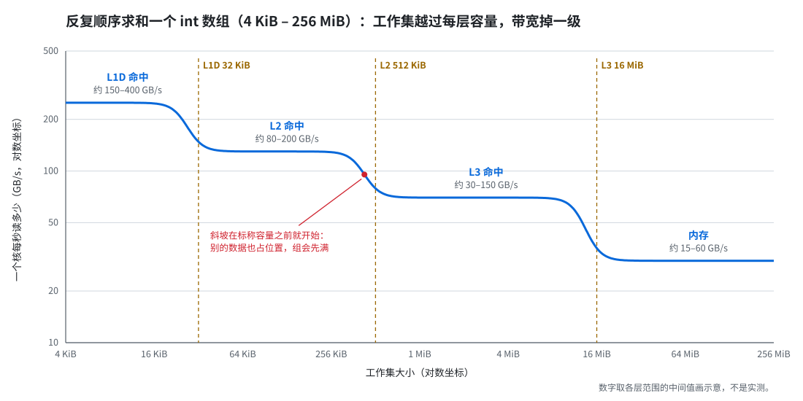
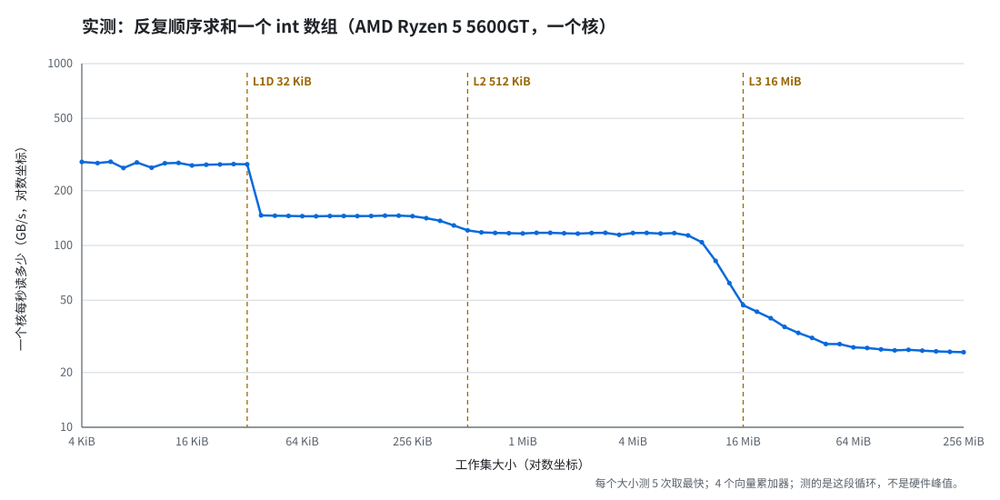

# 11补 内存层级:延迟与带宽(专题)

> 读法:先看"专题地图"知道三轮各管什么,再按轮读。每轮末尾有检验题,作答后写"附 N"。
> 来由:2026-10-03 用户读了三篇知乎文章(《低时延交易设计》系列的"大页内存""内存带宽""内存时延")后提出:前面各节学的多是"怎么优化"的具体方法,"延迟""带宽"这两个概念本身没有立起来,知识是零散的。本专题不对应源笔记某一节,把 #1、#5、#7、#11 散落的内容按"延迟 / 带宽"两根轴重新串起来。

## 专题地图

| 轮 | 管什么 | 接回哪些已学内容 |
|---|---|---|
| 轮 1 两个量 | 延迟和带宽各是什么、为什么带宽 ≠ 1/延迟、你的代码受哪个限制 | #11 轮 3"为什么只慢 4 倍"、#11 轮 2 pointer chasing |
| 轮 2 带宽这一侧 | 工作集台阶、读写不对称、写缺失要先读回(RFO)、绕过缓存的流式写、多核共享带宽 | 5补 MESI(I→M)、#11 轮 3 多通道、#01 锁频 |
| 轮 3 延迟这一侧 | 一次缺失从 TLB 到内存条逐段拆开记账、TLB 缺失和大页、预取怎么藏延迟、NUMA 远端 | #07 大页、#11 轮 3 DRAM、#01 NUMA、硬件地图“读（load）的路径” |

---

## 轮 1 两个量:延迟与带宽

核心句:**延迟是"一个请求从发出到拿到要多久",带宽是"单位时间能拿回多少数据";两者靠"同时在路上的请求数"连起来,所以带宽 ≠ 1/延迟。**

### 1. 在硬件地图上的位置

打开 [硬件地图](../硬件地图.md):前面各节讲的都是**框**(L1D、L2、L3、内存控制器、内存条)。延迟和带宽讲的是**框与框之间的那段路**:

- **延迟**(latency):从核发出一次 load,到数据回到寄存器,中间走的时间。走得越远越久——L1 命中只在核内,内存访问要一路走到内存条再回来。
- **带宽**(bandwidth):这段路上单位时间能运回多少字节,单位 GB/s。

类比一条高速公路:延迟是一辆车从 A 开到 B 要多久;带宽是 B 端每小时到达多少辆车。**加车道不会让单辆车开得更快**,只是让同一时间路上能跑更多车。

### 2. 各层的典型数字

约 4 GHz，都是帮助理解的量级：

| 层 | 一次访问的延迟 | 单个核能拿到的带宽（顺序读） |
|---|---|---|
| L1D | 约 1 ns（4–5 周期） | 约 150–400 GB/s（每周期能读 2–3 次、各 32–64 B） |
| L2 | 约 3–5 ns | 约 80–200 GB/s |
| L3 | 约 10–30 ns | 约 30–150 GB/s |
| 内存 | 约 70–120 ns | 约 15–60 GB/s。整颗芯片看通道数，两个通道约 50–100 GB/s |

两列都随层级变差，但**变差的倍数不一样**：L1 → 内存，延迟差约 100 倍，单核带宽差约 10 倍。这已经说明它们不是同一个量的两种写法。

这里的“一次访问”永远是**一整条缓存行**（x86 上 64 B，#5 轮 4）。哪怕只读 1 个字节，路上运的也是 64 B。

### 〔补〕带宽需求与计算强度：CPU 想吃多快（用户追问，2026-10-03）

上表只有"供给侧":每层每秒**能送来**多少字节。判断带宽是不是瓶颈,还要"需求侧":循环每秒**想吃掉**多少字节——假设数据零成本到手,CPU 自己算得多快。规则只有一条:

$$
\text{实际速度} \;=\; \min\big(\,\text{CPU 想吃的速度（带宽需求）},\;\; \text{数据所在那层能送的速度}\,\big)
$$

哪边小，哪边就是瓶颈。

CPU 想吃多快（**带宽需求**），取决于循环每处理 1 个字节要算多少，这个比值叫**计算强度**（arithmetic intensity），二/#1 roofline 会系统讲。三个例子，同样按 4 GHz 算：

| 循环 | CPU 想吃的速度 | 从哪一层开始受带宽限制 |
|---|---|---|
| 标量求和 `s += a[i]`（`int`，一个累加器，每周期 1 次加法） | 4 B/周期 × 4 GHz = 16 GB/s | 只有内存那一级勉强追平（一个核读内存约 15–60 GB/s，快的机器上连内存都比它快）。在 L1/L2/L3 里，瓶颈是那条加法依赖链，不是带宽 |
| SIMD 向量化求和（AVX2，每周期 2 次 32 B 读） | 64 B/周期 = 256 GB/s | 出了 L1 就受限：L2 约 80–200 GB/s 已经喂不饱 |
| 每个元素要做 100 次以上运算（比如算一个复杂指标） | 每周期不到 1 B | 几乎永远受计算限制（compute-bound），数据在内存里也一样 |

怎么读:

- **算得越少、越向量化，越早撞上带宽**。同一个求和，向量化后快了 16 倍，但数据一出 L1 就被带宽拦住；标量版自己就慢，带宽只在最底层才追上它。
- 这就是知乎“内存带宽”那篇里性能曲线呈**台阶**的原因：数组每掉出一层缓存，供给侧换成更低的那一档，只要它低于需求侧，速度就跟着掉一级。
- 对照 #11 轮 3 的 M1 实测：**按行走约 0.05 ns 读一个 4 B 的 `int`，换算约 80 GB/s**（4 B ÷ 0.05 ns；矩阵 256 KiB–2 MiB，在 L2 里）。一个标量循环做不到这么快，说明编译器把它向量化了。它停在 80 GB/s 左右，正落在一个核读 L2 的带宽范围里（约 80–200 GB/s）：向量化求和在 L2 里受的正是带宽限制。

HFT 热路径反过来:每条行情只碰几条缓存行,需求侧的"字节/秒"很小,带宽几乎从不成瓶颈,怕的是第 4.2 节的延迟。带宽是瓶颈的地方是批量处理:行情回放、回测、日志落盘、大块拷贝。

#### 向量化（SIMD）与多个累加器：表里这两个词是什么（用户追问，2026-10-09）

- **向量化**（vectorization，也叫 SIMD，single instruction multiple data，单指令多数据）：一条指令同时处理一排数。AVX2 的向量寄存器宽 256 位（32 B），装得下 8 个 `int` 或 8 个 `float`，一条加法指令做 8 次加法。标量循环一条指令只做 1 次。一次向量读 32 B，正好装满一个寄存器，多数核每周期能发 2 次读，就是表里的“每周期 2 次 32 B 读”。向量化可以交给编译器（`-O3`，再用 `-mavx2` 或 `-march=native` 放开 AVX2，否则默认只用 16 B 宽的 SSE），也可以手写 intrinsics（编译器内置函数，如 `_mm256_add_epi32`）。
- **多个累加器**（multiple accumulators）：`s += a[i]` 每一步都要等上一步的结果，这条链叫**依赖链**（dependency chain）。只有一个累加器时，加法一次接一次地做，读端口喂不满。把 `s` 拆成几个互不依赖的累加器，最后再合并，就有几次加法同时在执行单元里进行，这叫**指令级并行**（ILP，instruction-level parallelism）。要拆几个，用的是下面第 3 节的 Little 定律：$\text{在途加法数} = \text{每周期完成的加法数} \times \text{加法延迟}$。整数向量加法延迟约 1 周期，2 × 1 = 2 个就够。`float` 加法延迟 3–4 周期，要 2 × 3–4 = 6–8 个。编译器会不会替你做，见下表。

GCC 对这两件事的实际处理：

| 求和 | 向量化 | 拆成多个累加器 |
|---|---|---|
| `int` | 自己做（开 `-O3`） | 不做，只用 1 个 |
| `float`，没开 `-ffast-math` | 不做：加法不满足结合律，换个加的顺序，结果最后几位会变 | 不做：标量加法，一条链 |
| `float`，开了 `-ffast-math` | 自己做 | 不做，只用 1 个 |

向量化，`int` 编译器会自己做，`float` 要加 `-ffast-math`。拆累加器，GCC 两种都不会自己做（`-funroll-loops` 也只是把同一条依赖链多写几遍），要手写。1 个累加器够不够，看数据在哪、加法延迟多长。`int` 加法延迟 1 周期，每周期 1 次 32 B 读，约 128 GB/s，数据在 L3 或内存里（15–150 GB/s）基本够用，在 L1/L2 里（80–400 GB/s）会被拖慢。`float` 加法延迟 3–4 周期，每 3–4 周期才 1 次 32 B 读，约 32–43 GB/s，内存里（15–60 GB/s）勉强够，L1/L2/L3 里都喂不满。别的编译器（如 clang）行为不同，要对着汇编看。

### 3. Little 定律：为什么带宽 ≠ 1/延迟

先算“如果一次只有一个请求在路上”：内存延迟 100 ns，每次运 64 B，

$$
\frac{64\ \text{B}}{100\ \text{ns}} = 0.64\ \text{GB/s}
$$

可实际单核顺序读能拿到约 15–60 GB/s，是这个数的 20–90 倍。差出来的倍数就是**同时在路上的请求数**（在途请求数，outstanding requests；能同时有几个叫 MLP，memory-level parallelism）。一般式是排队论里的 **Little 定律**：

$$
\text{带宽} \;=\; \frac{\text{在途请求数} \times \text{每个请求的字节数}}{\text{延迟}}
$$

反过来：按单核 35 GB/s、延迟 80 ns 算，35 GB/s × 80 ns ≈ 2800 B ≈ 44 条缓存行同时在路上。这比 LFB 的 12–24 项多，多出来的是 L2 预取器在 L2 自己的未完成请求队列（L2 的 MSHR）里替你挂的。预取帮不上时（随机地址，或者步长每次都跨页），只剩 LFB 那 12–24 项：$\dfrac{(12\text{–}24) \times 64\ \text{B}}{80\ \text{ns}} \approx 10\text{–}20\ \text{GB/s}$。

谁让它们能同时在路上:

- **乱序执行**：后面的 load 不等前面的 load 回来就先发出去（#5 轮 1、轮 5 讲过乱序和依赖链）。能往后看多远，由 **ROB**（重排序缓冲）决定，见本节后面的〔补〕。
- **LFB**（line fill buffer，行填充缓冲；AMD 叫 MAB，论文里叫 MSHR）：L1D 用来记“哪些缺失还没回来”的小表，一个核 12–24 项，它限制了核自己能同时挂多少个缺失。
- **硬件预取器**：看出你在顺序走，它自己提前发请求，不占你的指令，还能再多挂一批。

所以带宽高，不是因为每个请求变快了，而是**车道多、车多**。每一辆车照样要开 100 ns。

### 〔补〕ROB：乱序执行能往后看多远（用户追问，2026-10-08）

来由：用户又带来一段外部材料，列了“决定 MLP 的完整硬件链条”：ROB / LSQ → L1D 的 LFB → L2 / L3 的 MSHR → 内存控制器的命令队列。（MLP 是 memory-level parallelism，就是本轮说的“同时在路上的请求数”。）用户问：“ROB 这里又是啥，需要了解吗？”此前只在〔补〕“一张总图”的 Q4 里提过一句。

核心句：**ROB（reorder buffer，重排序缓冲）是乱序执行的账本：指令按程序顺序进，谁的输入先备齐谁先做，再按原顺序退休。一个缺失卡在队头时，核还能往后找多远的独立 load，由它的大小决定**。

#### 在硬件地图上的位置

[硬件地图](../硬件地图.md)核心 0 最上面那个框：“流水线：取指 → 译码 → 乱序执行 → 退休”。ROB 管的是“乱序执行 → 退休”这一段。它不在数据走的那条路上：它不存数据，存的是还没退休的指令。但一个核能一口气往那条路上发几个访存，要看它。

#### 乱序执行与按序退休：它怎么工作

```cpp
x = a[i];      // ① 缺失，要去内存，约 80 ns
y = b[j];      // ② 和 ① 无关，也缺失
s += x;        // ③ 要等 ①
t = y * 2;     // ④ 要等 ②
```

- **进**：按程序顺序。译码出来的指令依次排进 ROB 的队尾，一条占一项（准确说是一个微操作）。
- **做**：谁的输入先备齐谁先做。② 不用等 ①，地址一算出来就发出去，于是 ① ② 两个缺失同时在路上。③ 等 ① 的值，④ 等 ② 的值。这就是 #5 轮 5 讲的：没有依赖的指令可以同时做。
- **退休**：只能从队头按顺序来。退休就是结果正式生效、腾出这一项。② 就算先回来，也要等 ① 退休了才轮到它。
- **为什么非按顺序退休不可**：没退休的结果都还是草稿。分支猜错、出了异常，把队头之后的草稿整段扔掉就行，程序看上去仍然是一条一条按顺序执行的。#5 轮 5 说“猜错了要把猜的那部分全部作废重来”，作废的就是 ROB 里排在那条分支后面的一段。#5 轮 1 的小本子也挂在这上面：一次写在退休之前随时可能被作废，退休之后才按顺序誊进 L1D。

#### 指令窗口与 MLP：它和“同时几个在路上”的关系

一次内存缺失要 300–500 个周期。缺失的 load 一到 ROB 队头就退休不了，后面的指令只能跟着排队，前端却还在往队尾加，每周期 4–8 条，200–600 项的 ROB 约 100 个周期（20–30 ns）就满了。满了以后新指令进不来，核就干等剩下的约 50–100 ns。所以能和这次缺失叠在一起的，只有它后面 200–600 条指令（**指令窗口**，instruction window）里那些互不依赖的 load。按 ROB 500 项算：

| 代码 | 两次独立缺失之间隔多少条指令 | 窗口里有几个 | 先撞哪一级 |
|---|---|---|---|
| 链表 `p = p->next` | 下一个地址要等这次读回来 | 1 | 依赖链，ROB 再大也没用 |
| `s += a[idx[i]]`，`a` 很大、`idx` 打乱 | 约 5 条 | 约 100 | LFB（12–24 项） |
| 每次查表之前先算约 150 条指令的哈希 | 约 150 条 | 约 3 | ROB |

合起来（只算核自己发的 load，不算预取器）：

$$
\text{同时在路上的缺失} \;\approx\; \min\Bigg(\underbrace{\frac{\text{ROB 项数}}{\text{两次独立缺失之间的指令数}}}_{\substack{\text{窗口里能找到几个} \\ \text{（依赖链时只有 1 个）}}},\;\; \underbrace{\text{LFB 项数}}_{\text{最多同时挂几个}}\Bigg)
$$

严格说，窗口是 ROB、load queue、寄存器这几样里最先满的那个，ROB 只是名义上限。load queue 只有 70–200 项，load 很密的循环里，它会比 ROB 先满。硬件预取器不受这个式子管：它的请求由 L1、L2 自己发，不占 ROB 和 load queue，所以顺序读能挂到约 30–70 个（第 3 节）。

#### 外部材料那条“链条”核对

1. **ROB / LSQ**：对。ROB 200–600 项，load queue 70–200 项，store queue 约 50–110 项。
2. **“L1D 的 LFB 通常 12~32 个”**：12–24 个，32 偏高。
3. **“L2 / L3 的 MSHR 通常 32~64 个”**：L2 这一级对得上，30–60 个。
4. **内存控制器的命令队列**：对，就是本轮〔补〕“DRAM 的 channel / rank / bank”里讲的通道、bank 并行。
5. **整体读法**：“沿路每一级都要占一项，最先满的那一级是上限”，对。再补一句：预取器的请求从中间某一级发出，前面几级管不到它。

顺带改正：LFB 原来写的“约 10–16 项”偏少，是 12–24 项。本轮第 3 节、〔补〕“一张总图”的 Q4、〔补〕“第二段外部材料核对”的第 1、2 条、[硬件地图](../硬件地图.md)和速查页都已改。“预取帮不上时”的单核带宽相应改成约 10–20 GB/s。

#### 要学到哪一层

- **现在要会**：“它怎么工作”那几句（按序进、乱序做、按序退休），一个缺失卡在队头时的“窗口”，再加一个量级：200–600 项，约 100 个周期就满，比一次内存缺失短得多。
- **后面还会用到两次**：#12 分支预测，猜错时 ROB 里排在分支后面的全部作废，代价从这来。#32 延迟测量，`rdtsc` 在执行时就读时钟，不等前面的指令做完，所以计时要配 `lfence` 或 `rdtscp`。
- **现在不用学**：寄存器重命名、调度器、执行端口、退休宽度这些实现细节。面试问到“乱序执行怎么实现”，答到“ROB 按序退休，所以猜错能整段回滚”，对 infra 岗一般够用。

### 4. 判断你的代码受哪个限制

只问一句:**下一次读的地址,要不要等上一次读回来才知道?**

#### 4.1 例子一:地址不依赖读到的值 → 受带宽(吞吐)限制

```cpp
long long s = 0;
for (int i = 0; i < n; ++i)
    s += a[i];          // 第 i+1 个地址是算出来的:&a[0] + 4(i+1),不用等 a[i] 回来
```

CPU 可以连续发出很多个 load,让一堆缺失同时在路上。瓶颈是"路上最多能挂几个、每秒最多运回多少字节",也就是带宽。

**这就是 #11 轮 3 M1 实验的情况。** 按列走的下标 `m[i * row_ints + j]` 也是算出来的,和读到的值无关。所以 0.81 ns/次是**吞吐**(总时间 ÷ 次数),不是一次 L2 访问的延迟(约 5 ns);5 ÷ 0.81 ≈ 6,就是平均六七个缺失同时在路上——这正是 Little 定律(推导)。

#### 4.2 例子二:地址就是上一次读到的值 → 受延迟限制

```cpp
struct Node { int value; Node* next; };
for (Node* p = head; p != nullptr; p = p->next)   // 下一个地址 = 这次读回来的 p->next
    s += p->value;
```

`p->next` 没回来之前,下一次 load 连地址都不知道,发不出去。路上永远只有一辆车,每一步付满一次延迟。这就是 **pointer chasing**(#11 轮 2 去规范化时讲过的"依赖链")。节点不在缓存里时,每步约 100 ns,带宽只用到 0.64 GB/s——路很宽,但只有一辆车。

常见的"受延迟限制"的结构:链表、`std::map`(红黑树,每层一个指针)、哈希表的冲突链、多级查表(先查合约 → 再查账户 → 再查风控参数,#11 轮 2)。

#### 4.3 怎么测才分得开

- 测**带宽**:顺序扫一个大数组,让预取和乱序全力工作,算 GB/s。
- 测**延迟**:把数组做成一个随机排列的环,每次 `k = q[k]`,让下一个地址依赖这次读到的值,预取猜不到、乱序也帮不上,算 ns/次。

同一块内存,两种测法的数字可以差一两个数量级。看别人的数字先问:**这是哪种测法?**

### 5. 带载延迟（loaded latency）：带宽用满，延迟上涨

路上车越多,越接近车道上限,就开始排队。内存控制器也一样:**整颗芯片的带宽利用率越高,单次访问的延迟越高**,接近上限时延迟可以涨到空闲时的两倍以上(常识量级,看平台)。这叫**带载延迟**(loaded latency)。

对 HFT 的意义:

- 热路径是"收一条行情 → 查订单簿 → 决策 → 发单",一串**有依赖**的访问,数据量很小,怕的是**延迟**。
- 但内存控制器和 L3 是全核共享的。同一颗芯片上别的进程在狂扫内存(回测、日志落盘、行情回放),带宽被吃满,热路径每次缺失都要排队——**绑核和隔离核只隔离了计算,没隔离这段路**(#01、#03)。
- 所以生产机上要么把这类吃带宽的任务挪走,要么用硬件的带宽/缓存分配功能限制它们(Intel 的 CAT 管 L3 分份,#5 轮 4 提过;MBA 管内存带宽,常识,没讲)。

### 〔补〕DRAM 的 channel / rank / bank 是"带宽"吗(用户追问,2026-10-03)

不全是。channel / rank / bank 是 DRAM 这个"仓库"的**结构**(#11 轮 3 第 4 节),延迟和带宽是这个结构跑出来的**结果**。每一层分别影响哪个量:

- **channel(通道)→ 主要管带宽。** 每个通道是一组独立的数据线,能同时各传各的。通道数就是车道数:双通道比单通道总带宽约翻倍,单次访问的延迟基本不变。
- **rank → 两边都沾一点,但不加带宽。** 同一通道上的几个 rank 共用那组数据线,同一时刻只能有一个在传;换 rank 传要空出几个周期。它的作用是让通道上能挂更多的 bank(推导)。
- **bank → 同时管两边。**
  - 带宽侧:不同 bank 可以各自开行、各自准备数据,让 DRAM 内部同时处理多个请求。这就是本轮第 3 节"同时在路上的请求数"在内存条里的那一段。
  - 延迟侧:每个 bank 的**行缓冲**决定单次访问快慢:命中已开的行约 14 ns,要先关旧行再开新行约 40 ns(#11 轮 3,DDR4 典型值)。

一句话:**channel 决定有几条车道,bank 决定仓库里有几个窗口能同时备货,行缓冲决定一个窗口给一辆车备货要多久。**

### 〔补〕一张总图:总时间 = 要搬的行数 × 每行摊到的时间(用户追问,2026-10-08)

来由:用户带来一段讨论(按列遍历每行 8 KiB 的大矩阵 → "浪费带宽" → LFB → padding),越追越矛盾:一会儿说瓶颈是带宽,一会儿说"退化成串行、暴露延迟"。根子是"要搬多少"和"搬得多快"没放进同一个式子。合起来:

$$
\text{总时间} \;\approx\; \underbrace{\text{要搬的行数}}_{\substack{\text{Q1 一条行用了多少字节} \\ \text{Q2 行能不能活到下次用}}} \;\times\; \underbrace{\text{每行摊到的时间}}_{\substack{\text{Q3 从哪一层取} \\ \text{Q4 同时几个在路上}}}
$$

每行摊到的时间倒过来，就是每秒能搬几条行。它有两层天花板，取小的那个：

$$
\text{每秒能搬的行数} \;=\; \min\Bigg(\underbrace{\frac{\text{在路上的个数}}{\text{延迟}}}_{\substack{\text{单核先撞这个} \\ \text{（Little 定律）}}},\;\; \underbrace{\frac{\text{峰值带宽}}{64\ \text{B}}}_{\substack{\text{多核一起压} \\ \text{才常撞这个}}}\Bigg)
$$

（2026-10-08 改：这里原来是一段用空格对齐的字符画，中文在等宽字体里宽度对不齐，括号错位；用户要求改用 LaTeX。）

#### 四个问题

- **Q1 一条行用了多少字节（空间局部性）**。连续读 `int`，一条 64 B 的行喂 16 个；步长 ≥ 64 B，每条行只用 4 B，同样多的有用数据要搬 16 倍的行。“浪费带宽”说的就是这一问，和总线满不满无关。步长 64 B 已经让这一问最差，再大也不会更差。数组在内存里时，步长 64 B 求和和连续求和都要把每条行搬一遍，花的时间差不多，前者只用到 1/16（推导，没测）。
- **Q2 搬进来的行能不能活到下次用（时间局部性）**。活不到的原因只有三种：**冷缺失**（第一次碰，谁也躲不掉）、**容量缺失**（要反复用的行比这一层装得下的多）、**冲突缺失**（地址挤进同一组，#11 轮 3 的关键步长）。padding 只治冲突。
- **Q3 从哪一层取**。决定延迟和峰值带宽（本轮第 2 节的表）。
- **Q4 同时能有几个在路上**。下一个地址要等这次读回来（4.2 的依赖链）→ 只有 1 个，每行付一整次延迟。地址是算出来的（4.1）→ 乱序执行把后面的读先发出去，每个缺失占一项 LFB，最多 N 个（12–24，第 3 节），每行摊到 $\text{延迟} / N$。硬件预取器还能替你再多挂一批（轮 3 讲）。这就是“流水线掩盖延迟”：不是延迟变短，是很多次等待叠在一起。能往后看多远受 **ROB**（重排序缓冲，见第 3 节后的〔补〕）限制，能挂多少受 LFB 限制，依赖链一个也提前不了。

最后和本轮第一个〔补〕取小：

$$
\text{实际速度} \;=\; \min\big(\,\text{CPU 想吃的速度},\;\; \text{每行有用的字节} \times \text{每秒能搬的行数}\,\big)
$$

#### 三个容易混的地方

1. **LFB 满了不是“退化成串行”**。满，恰恰是重叠最多的时候：N 项都在路上，第 N+1 个缺失等最早那一项回来、腾出位置再发，稳态一直有 N 个在路上，每行摊到 $\text{延迟} / N$（比如 80 ns、16 项 → 5 ns 一条）。真正串行的只有依赖链。所以**带宽和延迟不是二选一**：单核带宽本身就是第 3 节的 $\text{在途请求数} \times 64\ \text{B} / \text{延迟}$，延迟变长（DRAM 行冲突、TLB 缺失），同样的 N 每秒搬的行就变少。
2. **“受带宽限制”有两层天花板**。单核先撞的通常是 $\text{在途请求数} / \text{延迟}$（一个核读内存约 15–60 GB/s），整颗芯片的总线峰值要多核一起压才常撞到（2 个通道就有 50–100 GB/s，第 5 节的回测）。另外，“每行摊到 5 ns”是吞吐的倒数，不是延迟，每一条照样走完 80 ns。把它叫“等效时延”，正是混淆的来源。
3. **padding 治冲突，不治容量**。#11 轮 3 的 `int m[64][1040]` 只有 64 行，按列走只碰 64 条行，错开组以后全放得进 L1D（512 条位置），第 1–15 列都在 L1 命中。换成 2048 行，一列就是 2048 条行（128 KiB）：padding 让它们平均分到 64 组，但每组 32 条抢 8 格，走完第 0 列 L1D 里只剩最后约 512 行，第 1 列从第 0 行开始在 L1 缺失、在 L2 命中（推导，按 LRU、L2 装得下）。要在 L1 命中，还得**分块**（#11 轮 3 第 2.1 节）：一次只走一段装得进 L1 的行，把这段的 16 列走完再换下一段。

#### 后面两轮怎么接

- 轮 2(带宽侧)填 Q1、Q2 和总线天花板:工作集台阶(容量)、写缺失要先读回(RFO,写一条行要搬两趟)、绕过缓存的流式写、多核抢总线与带载延迟。
- 轮 3(延迟侧)填 Q3、Q4:一次缺失从 TLB 到内存条逐段记账、TLB 与大页、预取器怎么替你多挂几个(以及为什么不跨页)、NUMA 远端。
- 二/#1 roofline 把"CPU 想吃多快 vs 内存送多快"正式化。

看任何访存的说法,先问它在回答四问里的哪一问;一段话里混了好几问,就拆开看。

### 〔补〕各部件的数字放进博客速查页;第二段外部材料核对(用户追问,2026-10-08)

来由：用户又带来一段与外部 AI 的讨论（预取 + 流水线时单核能跑多少、Golden Cove 的 LFB、“CPU 处理速度多少，处理快带宽才成瓶颈”、计算强度），说“吞吐、带宽、各个部件的大致数值，我都需要一个整体的了解”，并要求把这类随时要查的东西放到博客上单独一处。已建博客**速查**区，第一页 [CPU 与内存：地图、数字、怎么估算](https://jasper-aa64.github.io/zh/ref/cpu-memory/)：1 地图（硬件地图挪到这里）、2 数字（延迟、带宽、同时在路上几个、CPU 想吃多快、内存条、跨核，都是帮助理解的范围）、3 怎么估算（上一个〔补〕的总图 + 例子）。数字以速查页为准，这里只记核对结论。

核对：

1. **“没有预取 → 单条串行，64 B ÷ 70 ns ≈ 0.91 GB/s”**：算术对，前提错。串行的是**依赖链**（下一个地址等这次读回来），不是“没预取”。没预取、地址互不依赖时，乱序执行照样能挂满 LFB：$\dfrac{(12\text{–}24) \times 64\ \text{B}}{80\ \text{ns}} \approx 10\text{–}20\ \text{GB/s}$。三档是 1 个 / 12–24 个 / 30–70 个在路上，不是两档。
2. **“Golden Cove 有 32 个 LFB，32 × 64 B ÷ 60 ns ≈ 34 GB/s”**：公式就是 Little 定律，对；“32 个 LFB”不对。L1D 的 LFB 只有 12–24 项，30–60 项那一级是 L2 的未完成请求队列（L2 的 MSHR）。单核顺序读能超过 $\text{LFB 项数} \times 64\ \text{B} / \text{延迟}$，靠的是 L2 预取器在 L2 那一级多挂请求：单核 35 GB/s × 80 ns 反推约 44 个在路上。
3. **“单核 40–60+ GB/s，约为双通道 DDR5 理论上限的 60%–80%”**：看机器：一个核读内存大约 15–60 GB/s，延迟越长越低。而且 40–60 ÷ 96 只有 42%–63%，和它自己写的比例对不上。
4. **“多核能 100% 刷满总线”**：读能到峰值的 70%–90%，到不了 100%：刷新、读写切换、bank 冲突都要占时间。
5. **“单核 L1 吞吐 2 × 32 B × 4.5 GHz = 288 GB/s，就是 CPU 的处理速度”**：这是 L1 读端口的上限（有的核每周期能读 3 次），只有向量化 + 多个累加器的循环才接近它。“CPU 处理速度”不是一个数：`float` 求和一个累加器、不开 `-ffast-math`，每次加法等上一次（3–4 周期），只吃约 4–5 GB/s，比单核内存带宽还低——所以材料里“`sum += A[i]` 是典型的带宽瓶颈”只在向量化之后才成立。
6. **“Over-the-Horizon Prefetching”**：核实不到这个术语，不用记。
7. **用户的直觉“处理速度快，带宽才会成为瓶颈”**：对，就是本轮第一个〔补〕的 $\text{实际速度} = \min(\text{CPU 想吃的速度}, \text{能送的速度})$。
8. **用户问“单通道 DDR5 50 GB/s 是瓶颈？CPU 最高就是 96 GB/s？”**：96 GB/s 是双通道 DDR5-6000 时**整颗芯片**内存那一级的峰值（2 × 48 GB/s）。一个核先撞的是 $\text{在途请求数} / \text{延迟}$，通常到不了它。“CPU 最高”也不是一个数，L1 约 150–400 GB/s，内存那一级才被通道数封顶。

### 轮 1 小结

- 延迟 = 一个请求多久回来;带宽 = 每秒运回多少字节;连接它们的是"同时在路上的请求数"。
- 地址不依赖读到的值 → 可以多个请求同时在路上 → 受带宽限制;地址依赖读到的值 → 一次一个 → 受延迟限制。
- 热路径怕延迟;别人吃满带宽会把你的延迟抬上去。

### 轮 1 检验题（已回，见附一）

**Q1.** 下面两段代码,各受延迟还是带宽限制?为什么?

```cpp
// A
for (int i = 0; i < n; ++i) s += prices[i];

// B
int k = 0;
for (int i = 0; i < n; ++i) k = next[k];   // next 是一个打乱的下标数组
```

追问:设内存延迟 100 ns、一个核最多同时挂 10 个缺失、每个缺失运 64 B。A 最多能拿到多少 GB/s?B 呢?

**Q2.** 有人说:"这台机器内存带宽 50 GB/s,所以从内存读 64 字节只要 64 ÷ 50 ≈ 1.3 ns。"错在哪?

追问:#11 轮 3 在 M1 上按列走,测到 0.81 ns/次,而 L2 一次访问约 5 ns。用本轮的公式解释这两个数为什么能同时成立。

**Q3.** 一个策略进程绑在隔离好的核上,热路径数据也都调成了紧凑布局。同一台机器上另一个核开始跑回测,顺序扫几十 GB 的历史行情。策略进程的热路径会受影响吗?为什么?

追问:热路径只读几条缓存行,用的带宽微乎其微,为什么它还是会被拖慢?

### 附一：轮 1 检验批改（2026-10-09）

**Q1 A/B 各受哪个限制：全对。**

- A 受带宽限制，B 受延迟限制，理由都对：A 的下标是算出来的，读可以提前发；B 的下一个地址要等这次读回来（pointer chasing），同一时刻只有 1 个在路上。
- “`s` 的累加是串行的，但不是取内存”这一点说得好。这条依赖链管的是加法，每步约 1 周期，数据在内存里时轮不到它当瓶颈（见〔补〕“带宽需求与计算强度”）。
- 追问的两个数都对：$\dfrac{10 \times 64\ \text{B}}{100\ \text{ns}} = 6.4\ \text{GB/s}$，$\dfrac{1 \times 64\ \text{B}}{100\ \text{ns}} = 0.64\ \text{GB/s}$，差 10 倍，差的就是在途个数。
- 补一句：6.4 GB/s 是只靠 LFB 的上限（题目设了 10 个）。真实的顺序读还有硬件预取器在 L2 那一级多挂一批，能到 30–70 个在路上，所以实际 A 常见 15–60 GB/s，B 没有这个帮手。

**Q2 “64 ÷ 50 ≈ 1.3 ns”：方向对，要把错在哪说完整。**

- “没算在途”是对的，完整的说法是：1.3 ns 是**吞吐**摊到每条行的时间（$1 / \text{带宽}$），不是一次读的**延迟**。单独读一条 64 B，照样要等约 80–120 ns。
- 50 GB/s 本身就是很多请求重叠出来的。用 Little 定律反推：$50\ \text{GB/s} \times 80\ \text{ns} = 4000\ \text{B} \approx 62$ 条行同时在路上，才能跑到这个数。
- 再补一层：50 GB/s 往往是整颗芯片的峰值，一个核先撞的是 $\text{在途请求数} / \text{延迟}$，通常到不了它。
- 追问对：$N = \dfrac{5\ \text{ns}}{0.81\ \text{ns}} \approx 6$，0.81 ns 是吞吐（总时间 ÷ 次数），5 ns 是一次 L2 访问的延迟，两者之比就是平均同时在路上的个数。这是从两个数反推出来的平均值，写“约 6 个”就够，6.17 的小数位没有意义。之所以能有 6 个重叠，是因为按列走的下标 `m[i * row_ints + j]` 是算出来的，和读到的值无关。

**Q3 回测扫内存：结论和两条机制都对。**

- 会受影响，两条原因都对：L3 被冲掉，内存控制器排队（带载延迟）。
- 两条是乘起来的：L3 被流式数据冲掉，热路径原来在 L3 命中（约 10–30 ns）的行变成去内存（约 80–120 ns），**缺失变多**；同时内存这条路被回测占满，**每次缺失还更慢**，接近上限时到空闲时的 2 倍以上。
- 补一个边界：热路径自己 L1/L2 里一直在用的那几条行是私有的，不会被别的核直接冲掉。被冲掉的是不那么频繁、已经退到 L3 的数据。（L3 是 inclusive 的芯片上，L3 踢掉一条行还会顺带作废核里的副本，那就连 L1/L2 也保不住。）
- 追问的点：带宽用得少 ≠ 不受带宽影响。热路径不缺带宽，缺的是延迟；它那几次缺失要和回测的几千个请求在同一个内存控制器里排队。这和 #10 的“不阻塞 ≠ 不变慢”是同一类话：绑核和隔离核只隔离了计算，没隔离 L3 和内存这段共享的路。
- 处理办法（第 5 节）：把回测挪到别的机器或别的 NUMA 节点，或者用 CAT 限它的 L3 份额、MBA 限它的内存带宽。

---

## 轮 2 带宽这一侧：容量、写、多核（2026-10-09）

核心句：**带宽侧的问题都能归到“要搬的行数”和“路有多宽”：数据装不进哪一层，就按那一层的带宽算；写一条不在缓存里的行，总线上要走两趟；多个核共用一条路，一个核单独跑时撞的是“在路上的个数 ÷ 延迟”，大家一起跑时才撞到通道总数**。

这一轮填〔补〕“一张总图”里的 Q1（每条行有用的字节，写要打折）、Q2（容量缺失）和第二层天花板（整颗芯片的峰值）。小目录：

1. 工作集台阶：数据装得进哪一层
2. 写缺失与 RFO：写一条行，总线上走两趟
3. 流式写（non-temporal store）：不读回、不进缓存
4. 多核共享带宽：两层天花板各归谁

### 1. 工作集台阶（working set）：数据装得进哪一层

在[硬件地图](../硬件地图.md)上，这一节讲的是 L1D、L2、L3 三个框各自装得下多少**。工作集**（working set）是一段代码在一段时间里反复碰的那些字节。工作集装得进哪一层，反复访问就在哪一层命中，速度就按那一层算。

做一个实验（推导，没测）：反复顺序求和一个 `int` 数组，数组大小从 16 KiB 一路加到 256 MiB，每个大小算一次“每秒读了多少字节”。

```cpp
// a 有 n 个 int，n × 4 B 就是工作集；反复扫 reps 遍
for (int rep = 0; rep < reps; ++rep)
    for (size_t i = 0; i < n; ++i) s += a[i];
```

按 L1D 32 KiB、L2 512 KiB、L3 16 MiB 的机器，曲线是 4 级台阶：

| 工作集 | 在哪层命中 | 一个核顺序读 |
|---|---|---|
| ≤ 约 32 KiB | L1D | 约 150–400 GB/s |
| 约 32 KiB – 512 KiB | L2 | 约 80–200 GB/s |
| 约 512 KiB – 16 MiB | L3 | 约 30–150 GB/s |
| > 约 16 MiB | 内存 | 约 15–60 GB/s |





〔实测〕本机跑出来的一条（AMD Ryzen 5 5600GT，一个核，GCC 16.2.0，`-O3 -march=native`，4 个向量累加器，每个大小测 5 次取最快；测的是这段循环，不是硬件峰值）：

- **四层平台都落在上面表格的范围里**。L1D 约 280 GB/s（267–289），L2 约 145（144–146），L3 约 116（114–117），内存约 26（25.9–27.5）。
- **拐点和虚线**。L1D→L2 正好切在 32 KiB 虚线上（32 KiB 279，下一个点 39 KiB 就 146）。L2→L3 的斜坡约 300 KiB 就开始，512 KiB 虚线处已滑过大半（121），约 1 MiB 落到 L3 平台。L3→内存的斜坡约 9 MiB 就开始，16 MiB 处约 47、才掉到一半；victim cache 没有让拐点整体右移，偏晚的是斜坡的结束——32 MiB 还有约 33，约 48 MiB 才贴到内存平台的 26，脱离 L3 是渐进的。

每过一个容量，反复访问的行就从“容量缺失”变成下一层去取（〔补〕总图的 Q2）。有 4 点要会讲：

- **拐点比标称容量早，而且是斜坡，不是直角**。
  - 别的数据也占着位置：栈、代码、页表项、其他变量。
  - 组相联不是完美的 LRU。L2、L3 按物理地址选组，操作系统给的物理页是零散的，有的组先满，整体还没装满就开始踢。
  - L3 是全核共享的，别的核也在用。
- **有的芯片拐点反而晚**。 L3 做成 L2 的 victim cache（被 L2 踢出的行才进 L3，L2 里有的 L3 不再存一份），能装的总量约是 L2 + L3。
- **顺序读的台阶比随机读的矮**。 顺序读有预取器提前搬，下一层的延迟大部分被藏住了，看到的是带宽差（约 10 倍）。随机的 pointer chasing 没有预取，看到的是延迟差（约 100 倍）。
- 随机访问还有一级 TLB 的台阶：工作集超过 TLB 能覆盖的范围（几 MiB），每次多一次查页表（轮 3 讲）。

这对 HFT 的意思：热路径的数据结构（订单簿、持仓、参数表）要压到 L1/L2 装得下，才谈得上每次几纳秒。紧凑布局（#11 轮 2）省的不只是行数，还让工作集往上挪一层。

### 2. 写缺失与 RFO：写一条行，总线上走两趟

在硬件地图上是“写一个变量”那条路：先进 store buffer，要写进 L1D 之前拿独占权（5补 的 I→M）。行不在缓存里时，要先把整条行从内存读回来，再在里面改，这叫 **RFO**（read for ownership）。原因是缓存只按整条 64 B 行管理：你只写了 4 B，剩下的 60 B 也得是对的。这种“写缺失也先把行分配进缓存”的做法叫**写分配**（write-allocate）。

改过的行是脏的。它被踢出缓存时，要写回内存（**写回**，write-back）。所以普通的写，每条行在总线上走两趟：

$$
\text{总线流量} \;=\; \underbrace{64\ \text{B}}_{\text{RFO 读回}} \;+\; \underbrace{64\ \text{B}}_{\text{踢出时写回}}
$$

例子：

```cpp
// 把一大块内存清零：看着只写，总线上是一读一写
void plain_zero(int* dst, size_t n) {
    for (size_t i = 0; i < n; ++i) dst[i] = 0;
}
```

- 清零 1 GiB（远大于 L3）：总线上走 2 GiB。按“写了多少字节 ÷ 时间”算出来的写带宽，只有总线流量的一半。
- `memcpy` 1 GiB：读源 1 GiB，RFO 目的 1 GiB，写回 1 GiB，一共 3 GiB，有用的只有 2 GiB。

store buffer 只能把写的**延迟**藏起来，后面的指令不用等。可它只有 50–110 项。写得很密时它会满，满了核就停下来等，这时速度受的是 RFO 的带宽。

**〔补〕RFO 的带宽大概多少（用户追问，2026-10-09）**：看行在哪，分三种。

$$
\text{一个核写内存的有用带宽} \;\approx\; \frac{\text{在途 RFO 数} \times 64\ \text{B}}{\text{延迟}}, \qquad
\text{整颗芯片的有用写带宽} \;\lesssim\; \frac{\text{芯片峰值} \times (70\%\text{–}90\%)}{2}
$$

- **行已经在 L1/L2 里、而且是自己独占的**：不用 RFO，速度按写端口算。每周期 1–2 次 32 B 的写，4 GHz 下约 130–250 GB/s。热路径反复写同几条行，就是这种情况。
- **一个核往远大于 L3 的数组写**：卡在同时在路上的 RFO 有几个。RFO 和读缺失一样占 LFB，L2 预取器也会替顺序写提前发 RFO，所以算法和读一样，代入数是约 10–40 GB/s 的有用写带宽，通常比同一个核的顺序读低一些：写回也要占路，store buffer 又只能按顺序把写交出去。
- **多核一起写**：撞的是整颗芯片的总线。每写一条行，总线上走两趟（RFO + 写回），所以有用的写带宽最多约峰值的一半，再算上读写切换的空等，只有峰值的 35%–45%。2 个通道、峰值 50–100 GB/s 的芯片，全核一起写，有用的约 20–40 GB/s。

这些都是用读那一侧的数推出来的，没有测。流式写把总线上的两趟变成一趟，整颗芯片的有用写带宽能回到峰值的 70%–90%。

读写还有一点不对称：DRAM 的数据线是双向共用的，从读切到写、再切回读，都要空等几个周期。读写混在一起的流，能跑到的比例比纯读低。

部分 CPU 对 `rep stosb` / `rep movsb` 这类整块的字符串指令做了优化：知道整条行都会被覆盖，就不做 RFO。glibc 的大块 `memset` / `memcpy` 会用它们，或者用下一节的流式写。

### 3. 流式写（non-temporal store）：不读回、不进缓存

**流式写**（non-temporal store，NT store；non-temporal 是“短期内不会再用”）是另一种写指令（x86 的 `movnti`、`movntdq`，intrinsic 是 `_mm_stream_si128` 等）。它不读回、不进缓存：同一条行的写先在**写合并缓冲**（WC buffer，write-combining buffer；Intel 上和 LFB 共用那 12–24 项）里凑，凑满 64 B 就整条直接写到内存。总线上只走一趟，`memcpy` 从 3 趟变成 2 趟。

```cpp
#include <immintrin.h>
// dst 按 16 B 对齐，bytes 是 64 的倍数（整条行写满）
void stream_zero(void* dst, size_t bytes) {
    __m128i z = _mm_setzero_si128();
    auto* p = static_cast<__m128i*>(dst);
    for (size_t i = 0; i < bytes / 16; ++i) _mm_stream_si128(p + i, z);
    _mm_sfence();   // 流式写是弱序的：发布“写完了”之前要先 sfence
}
```

（这两段代码在 [11-补-write-check.cpp](11-补-write-check.cpp) 里编译运行过，只验证结果正确，没有计时；g++ 13.3.0，x86-64 Linux。）

用它有三个坑：

1. **要整条行连续写满**。 只写了半条，WC 缓冲被迫提前送出，变成几次部分写，比普通写还慢。
2. **它是弱序的**。 x86 的普通写彼此按顺序可见（§5 轮 2 的 TSO），流式写是例外。写完一批数据再写一个“已就绪”标志，中间要 `_mm_sfence()`，否则别的核可能先看到标志、后看到数据。
3. **数据落在内存，不在缓存**。 原来缓存里有这条行，也会被作废。马上就要读它（你自己或别的核），就要付一次完整的内存缺失，约 80–120 ns。

所以它适合“写一大片、短期内没人读”的数据，例如超过 L3 的大块拷贝、往大文件缓冲里写日志。glibc 的 `memcpy` 在大小超过一个约为 L3 量级的阈值后，自动换成流式写。反过来，核间的 SPSC 队列（#09、#10）写进去马上就被另一个核读，用流式写等于把数据先推到内存，再让消费者从内存拉回来，不能用。

### 4. 多核共享带宽：两层天花板各归谁

在硬件地图上，L3、内存控制器、通道是全核共享的框。〔补〕总图里的两层天花板，在这里分清各归谁：

$$
\text{一个核单独跑} \;\approx\; \frac{\text{在途请求数} \times 64\ \text{B}}{\text{延迟}}, \qquad
\text{k 个核一起跑，每个核} \;\approx\; \min\Big(\text{单独跑},\;\; \frac{\text{芯片峰值} \times (70\%\text{–}90\%)}{k}\Big)
$$

- **一个核单独跑，撞的是第一层**。 例如在路上 40 个、延迟 100 ns：40 × 64 B ÷ 100 ns ≈ 25.6 GB/s。这跟芯片有几个通道无关。
- **核一多，撞的是第二层**。 2 个通道、峰值约 50–100 GB/s 的芯片，2–4 个核一起扫就满了。再加核，总量不涨，每个核分到的变少，延迟还往上涨（轮 1 第 5 节的带载延迟）。
- **通道多的芯片，也是核多的芯片**。 8–12 个通道、约 200–500 GB/s，配 32–128 个核，全核一起扫，每个核只分到几 GB/s，比一个核单独跑还少。这类芯片片上的路更长，内存延迟往往也更长，所以一个核单独跑也拿不了多少，只占峰值的一小部分（速查页 2.2 说的约 10%–80%）。
- **加通道只抬第二层**。 一个核单独跑时，加通道几乎没用。要抬第一层，只能让更多请求同时在路上（预取、去掉依赖链），或者缩短延迟。
- 锁高核心频率（#01）也抬不了内存带宽：DRAM 那段的 ns 不随核心频率变，核越快，一次缺失折成的周期反而越多。

HFT 的意思：热路径吃的带宽很少，它在意的是第二层被别人撞满以后的排队（轮 1 附一 Q3）。回测、行情回放、日志这类吃带宽的任务，放到别的机器或别的 NUMA 节点，或者用 MBA 限住。

### 轮 2 小结

- 工作集装进哪一层，就按那一层的带宽算；拐点早、是斜坡；顺序读的台阶比随机读的矮。
- 普通写一条不在缓存里的行，总线上走两趟（RFO + 写回）；流式写走一趟，但要写满整行、加 `sfence`，而且数据落在内存里。
- 一个核单独跑撞的是“在路上的个数 ÷ 延迟”，多核一起跑撞的是通道总数；加通道只抬后一层。

### 轮 2 检验题（待回）

**Q1.** 一台机器 L1D 32 KiB、L2 512 KiB、L3 16 MiB。反复顺序求和一个 `int` 数组（代码见第 1 节），数组从 16 KiB 加到 256 MiB。“每秒读多少字节”的曲线有几级台阶、大致在哪里拐？为什么拐点不正好落在 32 KiB、512 KiB、16 MiB？

追问：同样的大小范围，换成随机 pointer chasing 测每次访问的延迟。台阶之间的落差，比顺序求和大还是小？为什么？

**Q2.** 用普通写的循环拷贝 1 GiB（源和目的都远大于 L3），内存总线上一共走多少字节？换成流式写呢？

追问：一个核往 SPSC 环形队列里写行情，另一个核马上读。为什么这里不该用流式写？

**Q3.** 一颗芯片 8 个通道、峰值约 300 GB/s、64 个核。设内存延迟 100 ns，一个核同时能有 40 个请求在路上。一个核单独顺序扫内存，能拿多少？64 个核一起扫，每个核大约拿多少？

追问：把通道从 8 个加到 12 个，上面两个数分别会怎么变？
