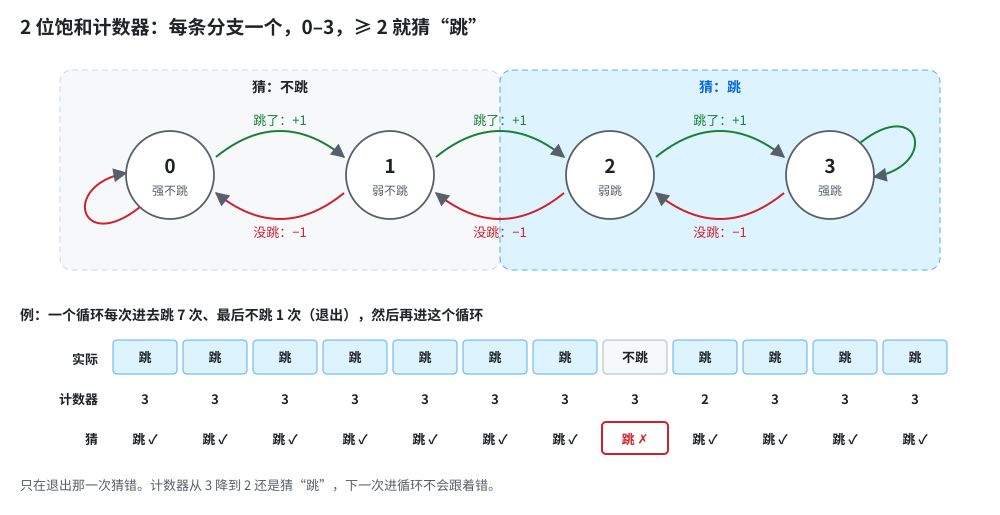
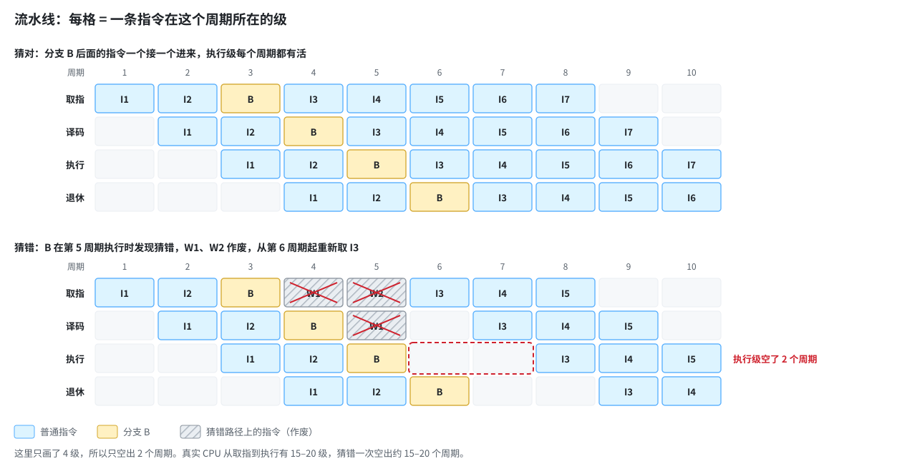
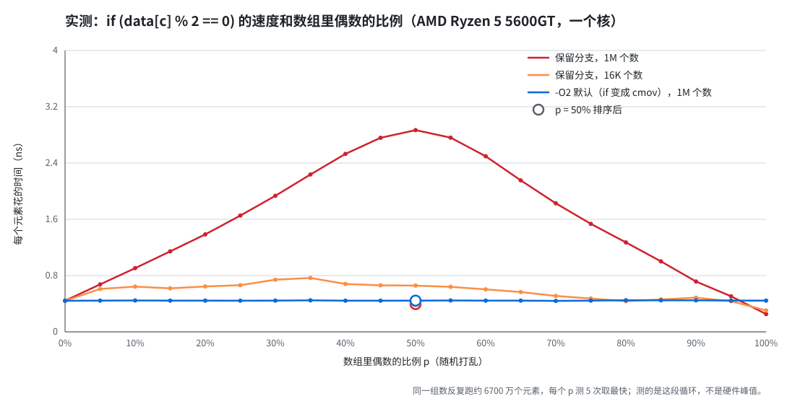
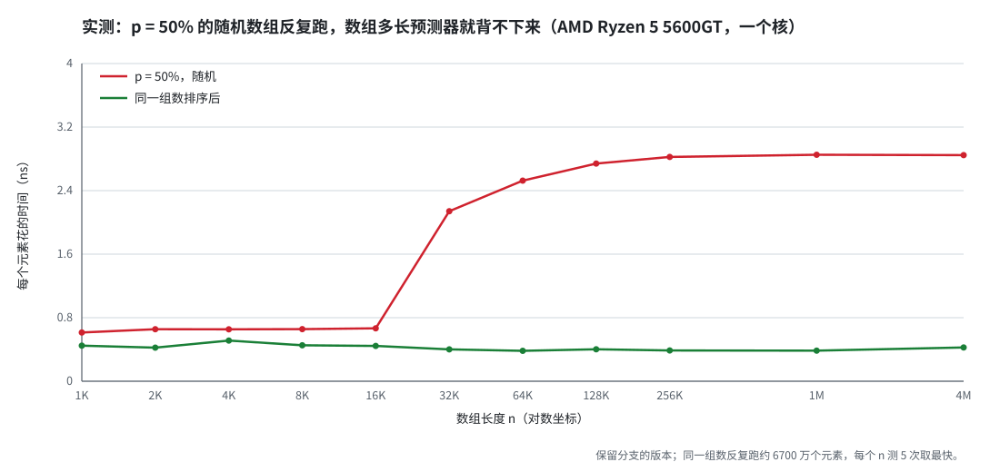
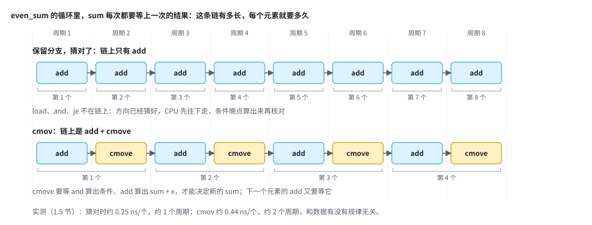
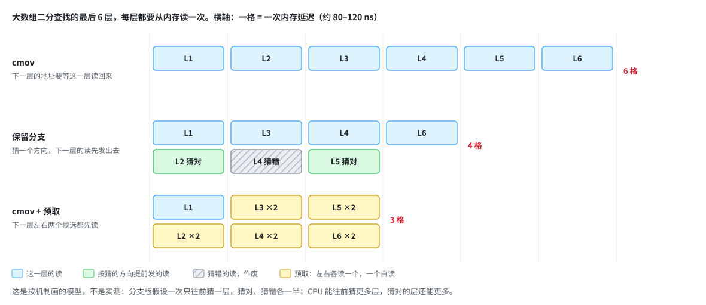
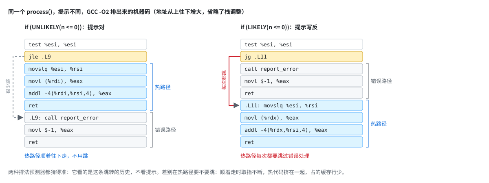

# 12 分支优化与分支预测

> 状态：轮 1 已讲、检验已批（附一）；轮 2 已讲（2026-10-10）、检验已批（附二）；轮 3 已讲（2026-10-10），检验待回。
> 读法：先看定位表知道源笔记每段在哪，再按轮读。每轮末尾有检验题，作答后写“附 N”。

## 源笔记定位

| 内容 | 源笔记 |
|---|---|
| 开头：猜错清空流水线、“计算比跳转更高效” | [源 :1](../../trading-system-notes/chinese/01-low-latency/12-分支优化与分支预测.md:1) |
| 分支统计与 PGO（`-fprofile-generate` / `-fprofile-use`）、HFT 热路径的 dummy 执行 | [源 :4](../../trading-system-notes/chinese/01-low-latency/12-分支优化与分支预测.md:4) |
| C++ 里的分支类型 | [源 :21](../../trading-system-notes/chinese/01-low-latency/12-分支优化与分支预测.md:21) |
| `if-else`、循环、`switch` 跳转表 | [源 :34](../../trading-system-notes/chinese/01-low-latency/12-分支优化与分支预测.md:34) |
| 消除分支：三元与 `cmov`、查表、无分支计算、循环展开 | [源 :62](../../trading-system-notes/chinese/01-low-latency/12-分支优化与分支预测.md:62) |
| 编译期分支：`if constexpr`、`enable_if`、`conditional`、concepts | [源 :147](../../trading-system-notes/chinese/01-low-latency/12-分支优化与分支预测.md:147) |
| 预测提示：`__builtin_expect`、`[[likely]]`、`noexcept`、`[[assume]]` | [源 :376](../../trading-system-notes/chinese/01-low-latency/12-分支优化与分支预测.md:376) |
| 慢路径移除（`cold` / `noinline`） | [源 :432](../../trading-system-notes/chinese/01-low-latency/12-分支优化与分支预测.md:432) |
| 依赖预测器的历史：排序 vs 不排序 | [源 :459](../../trading-system-notes/chinese/01-low-latency/12-分支优化与分支预测.md:459) |
| 半静态分支（运行时改写 `jmp`） | [源 :538](../../trading-system-notes/chinese/01-low-latency/12-分支优化与分支预测.md:538) |
| 编译期分支决策树 | [源 :584](../../trading-system-notes/chinese/01-low-latency/12-分支优化与分支预测.md:584) |

## 三轮怎么分

| 轮 | 管什么 | 源笔记 |
|---|---|---|
| 轮 1 分支预测器 | CPU 为什么要猜、怎么猜、猜错多贵、什么数据猜得准、怎么测 | :1–2、:21–31、:459–535 |
| 轮 2 消除分支 | `cmov` 与三元、查表、无分支计算、`switch` 跳转表、循环展开，以及“无分支不总是更快” | :34–144 |
| 轮 3 提示与分离 | `likely` / `unlikely`、PGO、冷热分离、编译期分支、半静态分支、编译期决策树 | :4–19、:147–456、:538–685 |

---

## 轮 1 分支预测器：CPU 为什么要猜、猜错多贵（2026-10-09）

核心句：**CPU 每个周期都要取后面的指令，可一条分支要到十几个周期后才算出往哪走，所以前端只能先猜；猜对了分支几乎不花钱，猜错了要把猜错之后的活全部扔掉重来，约 15–20 个周期。猜得准不准，看分支方向有没有规律，而规律来自数据。**

小目录：

1. 在硬件地图上的位置：前端
2. 为什么必须猜：流水线比分支间隔长
3. 预测器怎么猜：方向、目标、历史
4. 猜错的代价：冲刷流水线
5. 数据决定猜得准不准：排序实验
6. 源笔记里的分支类型各归哪个预测器

### 1. 在硬件地图上的位置：前端

前面各节讲的都是硬件地图上“数据”那一侧：load / store、缓存、内存。分支预测在另一侧，**前端**（front end）：负责取指令、译码，把指令送进后端去执行。顺序是：

1. **取指**（fetch）：按“下一条指令的地址”从 L1I（指令缓存）取一段字节。
2. **译码**（decode）：拆成微操作（µop）。
3. **重命名、进 ROB**：进入 11补 讲过的乱序窗口。
4. **执行**：分支在这里才真正算出条件、知道往哪走。
5. **退休**：按程序顺序确认。

**分支预测器**（branch predictor）就挂在第 1 步旁边：每取一段指令，它当场回答“这里面有没有分支、往哪跳”，取指单元按它的回答去取下一段。

### 2. 为什么必须猜：流水线比分支间隔长

两个数放在一起就明白了：

- 从取指到执行，一条指令要走约 15–20 个周期（流水线深度）。
- 普通代码里，每 5–7 条指令就有一条分支（约 15%–20% 的指令是分支）。前端每周期能取 4–8 条指令，也就是几乎每个周期都会碰到分支。

如果每碰到一条分支都停下来等它执行完再取后面的指令，每条分支要白等 15–20 个周期，CPU 一大半时间在空转。所以前端不等，先按预测的方向接着取、接着执行，这叫**推测执行**（speculative execution）。推测执行的结果先放在 ROB 里，分支算出来确认猜对了，才允许它们退休。

### 3. 预测器怎么猜：方向、目标、历史

这里的“分支”泛指所有会改变“下一条指令从哪取”的指令：`if` 编译出的条件跳转、函数调用 `call`、函数返回 `ret`、虚函数这类间接跳转。预测器猜的始终是**下一条指令的地址**，不是数据的值（函数的返回值是数据，放在寄存器里，不用猜）。一条分支要猜两件事：**往不往跳**（方向），**跳到哪**（目标）。不同的分支，难的地方不一样：

- **目标**：靠 **BTB**（branch target buffer，分支目标缓冲），按分支指令的地址记“上次跳到了哪”，约 4000–12000 项。取指时一查，就知道这段字节里有没有已知的分支、目标在哪。
- **函数返回**：`ret` 一定会跳，难的是跳回哪。同一个函数被不同的地方调用，就要回到不同的地方：

  ```cpp
  void log_it() { /* … */ }                // 结尾是一条 ret
  void on_trade() { log_it(); update(); }  // 这次 ret 要回到这里，接着执行 update()
  void on_quote() { log_it(); quote(); }   // 下次同一条 ret 要回到这里，接着执行 quote()
  ```

  靠 **RAS**（return address stack，返回地址栈，16–32 项）：取指时看到 `call`，就把“调用完该回到哪”压进去；看到 `ret`，就弹出栈顶，当作目标去取指。它仍然是“猜”：压栈和弹栈都发生在取指的时候，而 `ret` 真正执行、从内存里的调用栈读出返回地址，要等 15–20 个周期以后，那时才核对对不对。只要 `call` 和 `ret` 一一配对，几乎总是对的。会猜错的有两种：调用层数超过 RAS 的容量（很深的递归）；`call` 和 `ret` 没配对，比如抛异常、`longjmp` 直接跳过了中间几层函数的 `ret`，RAS 里剩下的旧地址会让后面几次 `ret` 猜错。
- **间接分支**（虚函数、函数指针、`switch` 的跳转表）：一条指令可能跳到多个目标，用**间接目标预测器**，按“这条指令 + 最近的历史”记目标。
- **方向**：最简单的是给每条分支一个 **2 位饱和计数器**：跳一次加 1、不跳减 1，在 0–3 之间，≥ 2 就猜“跳”。它能把循环猜得很准（跳 99 次、最后不跳 1 次，只错最后一次），偶尔一次反常也不会立刻改主意。



现代预测器在这之上加了**历史**：把最近 50–1000 条分支的结果（跳 / 不跳）记成一串**全局历史**（global history），和分支地址一起去查表。这样它能学会“上一条分支跳了，这一条就不跳”“每 3 次跳 1 次”这类规律。业界主流的设计（TAGE 一类）用几张表，各自配不同长度的历史，取最长的那个命中的。结果是：**有规律的分支，哪怕规律很长，也能学会；没有规律的分支，谁也学不会。** 一个每次都是随机 50/50 的条件，再好的预测器也只能猜对一半。

普通程序里，这些结构加起来能猜对 95%–99% 以上的分支。

### 4. 猜错的代价：冲刷流水线

分支执行时发现猜错了：

1. 猜错之后取进来的所有指令（还在流水线里的、已经进 ROB 的、已经执行完的）全部作废。
2. 取指单元回到正确的地址，从头开始取。
3. 新指令要再走一遍取指、译码、重命名，才能重新填满后端。



代价约等于从取指到执行的流水线深度，**约 15–20 个周期**，4 GHz 下约 4–5 ns。按每周期 4–8 条算，等于丢掉 60–160 条指令的执行机会。（猜错的路径上发出的 load 已经把行搬进了缓存，这一点不会撤销，这也是 Spectre 这类漏洞的来源，这里不展开。）

拿 11补 的数对比：一次 L1 命中约 1 ns，一次 L2 命中约 3–5 ns，一次分支预测失败约 4–5 ns。热路径上一次猜错，和一次 L2 命中差不多贵。区别是：缓存缺失可以和别的缺失重叠（MLP），分支预测失败把后面的活全扔了，没法和自己后面的工作重叠。

### 5. 数据决定猜得准不准：排序实验

源笔记的例子（[源 :484](../../trading-system-notes/chinese/01-low-latency/12-分支优化与分支预测.md:484)，`data` 是 16384 个 0–199 的随机整数，外层重复 10000 遍）：

```cpp
for (unsigned i = 0; i < 10000; ++i) {
    for (unsigned c = 0; c < arraySize; ++c) {
        if (data[c] % 2 == 0) {
            evenSum += data[c];
        }
    }
}
```

同一段循环，`data` 排序和不排序跑两遍（源 :516 只多了一行 `std::sort`）。

- **不排序**：每个数是奇是偶完全随机，这条 `if` 的方向没有规律，预测器只能猜对约一半。每个元素平均多付 $0.5 \times (15\text{–}20) \approx 8\text{–}10$ 个周期，比循环体本身（1–2 个周期）贵好几倍。
- **排序后**：0–199 每个值大约有 82 个，排好以后是 82 个偶数、82 个奇数、82 个偶数……这样一段一段交替。一共 200 段，方向只在段与段的边界上变，每个交界处猜错 1–2 次，一遍 16384 次里只错约 200–400 次，约 1%–2%。


所以排序后快好几倍（实测见本节后面）。这个例子说明：**同一条分支、同一段代码，可预测性来自数据**。

**这里有一个编译器的坑**：GCC 13.3 在 x86-64 上从 `-O1` 起就把这个 `if` 变成了无分支的写法，内层循环里只剩 `and`（取最低位）加 `cmove`（条件成立才把加完的值搬回 `evenSum`），没有条件跳转；`-O3` 还会向量化。这时排不排序一样快，实验看不到差别。想看到分支预测失败的代价，要加 `-fno-if-conversion -fno-if-conversion2 -fno-tree-vectorize`，内层才会留下 `je`。所以讨论“这里有没有分支”之前，先看汇编。（`cmov` 为什么能消掉分支、什么时候编译器不敢用，是轮 2 的内容。）

（上面的循环在 [12-branch-check.cpp](12-branch-check.cpp) 里编译运行过，验证排序前后结果一致、排序后正好 200 段，并看了 `-O2` 的汇编；没有计时。g++ 13.3.0，x86-64 Linux。）





> 〔实测〕（AMD Ryzen 5 5600GT，一个核，GCC 16.2.0，`-O2`；保留分支的版本加 `-fno-if-conversion -fno-if-conversion2 -fno-tree-vectorize`。数组里偶数的比例 p 从 0% 扫到 100%，同一组数反复跑约 6700 万个元素，每个点测 5 次取最快）：
>
> - **保留分支、100 万个数：一顶帐篷**。p = 50% 时约 2.87 ns/个，排序后约 0.40 ns，快约 7 倍。曲线几乎是直线爬上去、再直线降下来：方向随机时，最好的猜法是一直猜多的那一边，猜错率就是 $\min(p, 1-p)$。每个元素多出来的时间约为 $\min(p, 1-p) \times 4.9\ \text{ns}$：p = 50% 时多 2.43 ns，也就是每次猜错约 4.9 ns；拿它去算 p = 25%，0.25 × 4.9 ≈ 1.2 ns，实测多 1.21 ns。
> - **`cmov` 版：一条平线**，约 0.44 ns/个，和 p、排不排序都没关系。每个元素都要等上一次的和算完（`add` 再 `cmove`，约 2 个周期），这条依赖链就是它的速度。
> - **两头，留着分支反而更快**。p = 100% 时全猜对，约 0.25 ns，比 `cmov` 快；p = 0% 时约 0.44 ns，因为每个元素要跳两次（跳过加法、循环回跳），被“每个周期大约只能执行一次跳转”卡住。什么时候该换成 `cmov`，第 2 部分讲。
> - **只有 16384 个数时，几乎看不出代价**。同样随机，p = 50% 只要约 0.66 ns，排序后约 0.44 ns，只差 1.5 倍。同一串 16384 个方向被反复跑了 4000 多遍，预测器用长历史把它背了下来。第二张图（[12-branch-bench.cpp](12-branch-bench.cpp)，`./bb-branch <n> 50`）在 p = 50% 上扫数组长度：16384 个以内都是约 0.6–0.7 ns，32768 个就跳到约 2.1 ns，26 万个以上稳定在约 2.85 ns。所以测分支的代价，不能拿一小段数据反复回放：真实的行情不会重复，回放测出来的会偏乐观。

**怎么测**：Linux 上 `perf stat -e branches,branch-misses ./prog`，直接给出分支总数和猜错的次数，比值就是预测失败率。Windows 上没有 `perf`，AMD 的机器用 AMD uProf，Intel 用 VTune。热路径上看到预测失败率在几个百分点以上，才值得动手。

### 6. 源笔记里的分支类型各归哪个预测器

源笔记 :21–31 列了 C++ 里会产生分支的写法，按第 3 节对上号：

| 写法 | 机器码里是什么 | 谁来猜 |
|---|---|---|
| `if` / `else`、三元 `?:`、`&&` / `\|\|` 的短路求值、循环条件、`break` / `continue` | 条件跳转（`jcc`），目标固定 | 方向预测器 |
| 直接函数调用 | `call` 一个固定地址 | BTB（无条件，几乎不会错） |
| 函数返回 | `ret` | RAS |
| `switch`（编译成跳转表时） | 间接跳转 `jmp [表 + 下标×8]` | 间接目标预测器 |
| 虚函数、函数指针 | 间接调用 `call [寄存器]` | 间接目标预测器 |

三元 `?:` 和短路求值不一定真的产生跳转：编译器可能把它们变成 `cmov`，就像第 5 节那样。短路求值则相反，`a && b` 往往会多出一条分支（`a` 为假就跳过 `b`）。

虚函数的预测看的是“这一处调用的实际类型有没有规律”：一个循环里对象类型总是一样，目标每次一样，几乎不错；类型随机混在一起，每次都可能错，和第 5 节的不排序一样。

### 轮 1 小结

- 前端每周期都要取指令，分支要十几个周期后才算出来，所以必须先猜，推测执行。
- 预测器猜目标（BTB、RAS、间接目标预测器）和方向（计数器 + 全局历史），有规律就学得会，随机的谁也学不会。
- 猜错约 15–20 个周期（4 GHz 下约 4–5 ns），猜错之后的活全部作废，不能和后面的工作重叠。
- 可预测性来自数据；讨论有没有分支之前先看汇编，编译器可能已经把它消掉了。

### 轮 1 检验题（已批，见附一）

**Q1.** 一颗 4 GHz、每周期能取 4 条指令的 CPU，流水线从取指到执行约 16 个周期。一次分支预测失败大约损失多少纳秒、多少条指令的执行机会？为什么 CPU 不干脆等分支算出来再取后面的指令？

追问：一次分支预测失败和一次 L2 命中差不多贵（都是几纳秒），为什么说预测失败更难被“藏起来”？

**Q2.** 第 5 节的循环（代码见第 5 节），`data` 是 16384 个 0–199 的随机数。不排序和排序后，这条 `if` 各大约猜错多少？排序为什么有用？

追问：有人用 `g++ -O2` 编译这两个版本，测出来一样快，就说“分支预测没那么重要”。错在哪？

**Q3.** 一个热循环对一批订单调用虚函数 `o->handle()`，订单里有三种子类。什么情况下这条虚函数调用几乎不会猜错，什么情况下经常猜错？它是哪个预测器负责的？

追问：同一个循环里还有一个 `return` 和一个固定次数的 `for`，它们各由谁来猜，为什么几乎不会错？

### 附一 轮 1 检验题批改（2026-10-10）

**Q1 对。** 一个周期 $1/4\,\text{GHz} = 0.25$ ns，16 个周期约 4 ns；每周期 4 条，丢掉 $16 \times 4 = 64$ 条指令的执行机会（这是上限，实际 IPC 到不了 4，真丢的少一些）。为什么不等：方向是对的，把账算出来更清楚。

- 等：每条分支都停 16 个周期。分支每 5–7 条指令就有一条，等于几乎一直在停。
- 猜：猜对时不花钱，猜错才付 16 个周期。猜对 97% 时，平均每条分支只付 $3\% \times 16 \approx 0.5$ 个周期。

**追问对。** L2 命中（或 L1 没命中）时，ROB 里后面不相关的指令照样执行，几个访存还能同时在路上（MLP），延迟被别的活盖住。猜错时，分支后面取进来的指令本来就是错路上的，全部冲掉，要从取指、译码、重命名重新走一遍，才能把后端填满。分支前面的老指令照样执行完，但这十几个周期里没有新的正确的活可做。所以猜错的代价不能和后面的工作重叠。

**Q2 对，补数字。** 不排序约 50%：0–199 的随机数，奇偶各一半，和抛硬币一样。排序后约 1%–2%：每个值重复约 $16384 / 200 \approx 82$ 次，奇偶连着一大段不变，只在 200 个交界处变一次方向。2 位计数器在每个交界错 1–2 次，一共约 200–400 次。“让跳转有规律”说对了，要落到“长段不变、只在交界错”这个数上。

**追问对。** GCC 从 `-O1` 起就把这个 `if` 变成 `and` + `cmove`，循环里没有条件跳转了，排不排序都约 0.44 ns/个。错的是结论：这段代码已经没有分支可猜，测不出预测器的作用，不能说“预测不重要”。要看分支本身，得先看汇编确认 `je` 还在（加 `-fno-if-conversion -fno-if-conversion2 -fno-tree-vectorize`），那时不排序约 2.87 ns/个，排序约 0.40 ns/个。

**Q3 对。** 虚函数调用是间接调用，归**间接目标预测器**（indirect target predictor）。它按“这条调用指令的地址 + 最近的分支历史”去查目标，所以：

- 几乎不错：一批订单全是同一种子类，目标每次一样；或者类型按短周期重复（A B C A B C），历史能把它认出来。实践中按类型分组处理，就是在制造这种规律。
- 经常错：三种类型随机混在一起，历史里没有规律，和不排序的 `if` 一样。

**追问对。** `return` 归 RAS，只要 `call` 和 `ret` 配对、层数不超过 16–32 项，就几乎不错。固定次数的 `for` 归方向预测器：循环末尾那条往回跳的分支，前 $N-1$ 次都“跳”，2 位计数器一直停在“强跳”，只有退出那一次猜错，一整个循环只错 1 次。如果 $N$ 不大（几十以内），全局历史还能记住“跳了 $N-1$ 次之后该不跳”，连退出那次也能猜对。

---

## 轮 2 消除分支：把“猜往哪走”换成“按条件选”（2026-10-10）

核心句：**消除分支，是把控制依赖换成数据依赖：不再猜往哪走，而是把要用的值都算出来，再按条件选一个。从此不会猜错，但每次都要等条件算出来，这份代价是固定的。分支难猜时赚，好猜时反而亏。**

小目录：

1. 控制依赖与数据依赖：消除分支换掉了什么
2. 五种写法（2.1 三元与 `cmov`；2.2 无分支计算；2.3 查表；2.4 `if-else` 链与 `switch`；2.5 循环展开）
3. 无分支不总是更快：怎么判断

验证程序：[12-branchless-check.cpp](12-branchless-check.cpp)（本节每段代码的结果都和有分支版本对过，汇编是 GCC 13.3 `-O2` 的输出；只验证正确性和指令形态，不计时）。

### 1. 控制依赖与数据依赖：消除分支换掉了什么

一条 `if` 在机器码里是条件跳转，后面的指令**取哪条**取决于条件，这叫**控制依赖**（control dependency）。轮 1 讲过，CPU 不等它，直接猜一个方向往下跑：猜对了，条件什么时候算出来都不影响速度；猜错了，付约 15–20 个周期。

把分支消掉，就是让后面要执行的指令固定下来，条件只决定**选哪个值**。这叫**数据依赖**（data dependency）：结果要等条件和两个候选值都算出来才能定，下一条用到结果的指令也得等。没有东西可猜，所以不会猜错。可它也没法“先往下跑”，条件那几个周期的延迟每次都要付。

所以消除分支是拿“偶尔一次 15–20 周期”换“每次多 1–2 个周期”。下面的五种写法都是这一笔交易，第 3 节算什么时候划算。

### 2. 五种写法

#### 2.1 三元与 `cmov`：两个值都备好，按条件选

**写法**（源 :62–68）：

```cpp
int pick(int input, int threshold, int value1, int value2) {
    return (input > threshold) ? value1 : value2;
}
```

**编译出来**：GCC `-O2` 生成

```asm
cmpl    %esi, %edi        # input 和 threshold 比较
movl    %edx, %eax        # 先放 value1
cmovle  %ecx, %eax        # 如果 input <= threshold，换成 value2
ret
```

**`cmov`**（conditional move，条件传送）不是跳转：它总是执行，只是按标志位决定目标寄存器要不要换成源的值。前端不用猜任何东西，取指一路往下走。

**什么时候不行**：编译器只在“两边都算一遍也安全、也不贵”时才这么做。

- **两边有副作用**（函数调用、写内存、I/O）：两边都执行就改变了程序的行为，不能变。
- **有一边要读内存、而这次读可能不合法**：

  ```cpp
  int load_or_zero(const int* p) {
      return p ? *p : 0;
  }
  ```

  GCC 生成的是 `testq %rdi, %rdi` + `je`，保留了分支。变成 `cmov` 就得无条件执行 `*p`，`p` 是空指针时会崩。
- **两边的计算很长**：两边都算，就把便宜那边省下的活白白做了。

反过来也成立：写成 `if`，编译器也可能自己变成 `cmov`。轮 1 的 `even_sum` 就是这样，源的 `sign` 有分支的版本在 GCC `-O2` 下也被编成了 `setne` + `cmovg`。三元只是更容易被变成 `cmov`，不保证。要确认，就看汇编。Clang 有 `__builtin_unpredictable(cond)`，告诉编译器这个条件难猜，倾向用 `cmov`。

#### 2.2 无分支计算：用比较结果和掩码算出来

**写法一：比较的结果本身就是 0 或 1**（源 :108–119）：

```cpp
int sign_branchless(int x) {
    return (x > 0) - (x < 0);   // 比较结果是 0 或 1，正数 1 - 0，负数 0 - 1
}
```

（源这里的注释写“依赖于符号位的算术右移”，与代码不符，已按代码改正：这里只用到了比较的结果。）GCC 编成 `setg` 取 `x > 0`，再用 `shrl $31` 取出符号位当作 `x < 0`，两者相减，没有跳转。

**写法二：掩码选择**。条件为真时掩码全 1，为假时全 0，再用 `&` 和 `|` 拼出结果：

```cpp
int select_mask(bool cond, int a, int b) {
    int mask = -static_cast<int>(cond);   // 1 -> 0xFFFFFFFF，0 -> 0
    return (a & mask) | (b & ~mask);      // cond ? a : b
}
```

掩码必须是“全 1 或全 0”。直接拿 `bool` 去 `&`，`1 & a` 只留下 `a` 的最低位，结果是错的。要按符号得到掩码，可以写 `x >> 31`：负数得到全 1，非负得到 0（C++20 起规定有符号右移是算术右移，之前是实现定义）。

**写法三：轮 1 的 `even_sum` 不用 `if`**：

```cpp
for (unsigned c = 0; c < n; ++c) {
    int x = data[c];
    sum += x & -static_cast<int>((x & 1) == 0);   // 偶数加 x，奇数加 0
}
```

编出来是 `not`、`and $1`、`neg`、`and`、`add`，循环里只剩末尾那条回跳。和 `cmov` 一样，`sum` 每次都要等这几条算完。

适用面：数值计算、选最大最小、钳位（clamp）。代价：可读性差，而且多数情况下编译器自己就能把简单的 `if` 变成 `cmov`，手写前先看汇编。

#### 2.3 查表：用下标取结果

**值查表**：输入范围小，就把每个输入的结果提前算好，运行时用输入当下标去取。

```cpp
constexpr int fee_bps[3] = {2, 5, 10};   // 三种订单类型的手续费率（万分之几）
int fee_lookup(unsigned type) { return fee_bps[type]; }
```

编出来就是一条 `movl (%rax,%rdi,4), %eax`，真的没有分支。代价变成一次访存：表在 L1D 里约 1 ns；表大到落进 L2 约 3–5 ns，已经和一次猜错差不多；落到内存约 80–120 ns，比猜错贵得多。所以查表只适合小表，热路径上的表要能一直待在 L1D 里。

**函数指针表**（源 :79–95）：

```cpp
using HandlerFunc = void(*)(const Order&);
constexpr HandlerFunc handlers[] = {handle_type_0, handle_type_1, handle_type_2};

void process_order(const Order& order) {
    if (order.type < 3) {
        handlers[order.type](order);
    }
}
```

编出来是：

```asm
movl    (%rdi), %eax            # order.type
cmpl    $2, %eax
ja      .L28                    # 边界检查：一条条件跳转
leaq    handlers(%rip), %rdx
jmp     *(%rdx,%rax,8)          # 间接跳转：目标从表里读
```

它没有消除分支，是把几条条件跳转换成了**一条间接跳转**，归**间接目标预测器**（轮 1 第 3 节）。订单类型有规律（全是同一种、或者短周期重复），几乎不错；类型随机混在一起，照样经常猜错，和虚函数一样。它的好处是：不管有多少种类型，都只有一条要猜的跳转，而不是一串 `if`。边界检查那条 `ja` 几乎总是不跳，好猜。

#### 2.4 `if-else` 链与 `switch`：编译器怎么排

**`if-else` 链**（源 :34–40）：每个条件是一条单独的条件跳转。代价看“一次走下来执行了几条、每条好不好猜”：最常见的情况放最前面，大多数时候只执行一两条就出来了。每条各自有预测器的记录，条件多了不会让每一条更难猜，只是走得越深，要过的条件跳转越多。

**`switch`**（源 :52–59）：GCC 按 `case` 的分布选三种做法，下面都是 `12-branchless-check.cpp` 里 `-O2` 的真实输出。

- **`case` 连续、每个 `case` 做不同的事 → 跳转表**：

  ```cpp
  switch (kind) {
      case 0: handle_type_0(o); break;
      case 1: handle_type_1(o); break;
      // ... case 2、3、4
  }
  ```

  ```asm
  cmpl    $4, %eax
  ja      .L30                     # 超出 0–4 就跳走
  leaq    .L33(%rip), %rdx         # .L33 是一张表，存每个 case 代码的相对地址
  movslq  (%rdx,%rax,4), %rax
  addq    %rdx, %rax
  notrack jmp *%rax                # 间接跳转
  ```

  和函数指针表一样，是一条间接跳转。查表本身和 `case` 数量无关，但“猜不猜得准”仍看 `kind` 有没有规律。
- **`case` 连续、每个 `case` 只返回一个值 → 值查表**：

  ```cpp
  switch (type) {
      case 0: return 2;
      case 1: return 5;
      // ... case 2、3、4
      default: return 0;
  }
  ```

  GCC 直接生成一张常量数组（汇编里叫 `CSWTCH`），一条 `movl (%rax,%rdi,4), %eax` 取值，只剩一条好猜的边界检查。这才是真的没有分支。
- **`case` 稀疏（1、10、1000）→ 一串比较**：`cmpl $10` + `je`、`cmpl $1000` + `je`，最后一个用 `cmovne`。`case` 多时会排成二分查找的比较树。

所以“把 `case` 改成连续”有用，但它换来的是跳转表或值查表。前者仍要猜，后者才消掉了分支。

#### 2.5 循环展开：少几次回跳，主要的收益不在分支

**写法**（源 :123–144）：一次迭代做原来几次的活。

```cpp
long long sum_unroll4(const int* a, unsigned n) {
    long long s0 = 0, s1 = 0, s2 = 0, s3 = 0;
    unsigned i = 0;
    for (; i + 4 <= n; i += 4) {
        s0 += a[i];
        s1 += a[i + 1];
        s2 += a[i + 2];
        s3 += a[i + 3];
    }
    for (; i < n; ++i) s0 += a[i];   // 剩下不到 4 个
    return s0 + s1 + s2 + s3;
}
```

**分支上省了什么**：每 4 个元素才有一次回跳。可轮 1 讲过，固定往回跳的循环分支本来就几乎不会猜错，展开省下的主要是 `i++`、`cmp`、`jne` 这几条指令本身，猜错几乎没少。循环体里如果有一条难猜的 `if`，展开以后它变成 4 条，一条也没少。

**真正的收益**：四个累加器 `s0`–`s3` 是四条独立的依赖链，可以同时跑。这就是 §5 轮 5 讲的多累加器，和分支无关。

**注意**：

- 源的例子是固定 4 次的循环，GCC `-O2` 自己就会全部展开，不用手写。
- 让编译器展开：GCC 写 `#pragma GCC unroll 4`，`#pragma unroll` 是 Clang 的写法。
- 展开越多，代码越大，会挤占 L1I 和 uop 缓存，热路径上不是越多越好。

### 3. 无分支不总是更快：怎么判断

**为什么 `cmov` 在好猜时反而慢**：看 `even_sum` 每个元素的依赖链。



`sum` 每次都要等上一次的结果。保留分支并且猜对时，链上只有一条 `add`，约 1 个周期；判断奇偶的 `and`、`je` 不在链上，晚点核对就行。换成 `cmov`，链上是 `add` 再 `cmove`，`cmove` 还要等条件，约 2 个周期。轮 1 的实测正好对上：p = 100% 时分支版约 0.25 ns/个，`cmov` 版约 0.44 ns/个，排序后分支版约 0.40 ns/个，也比 `cmov` 快。

**什么时候换**：比较两边每个元素多付的时间。

$$
\underbrace{\text{猜错率} \times \text{一次猜错的代价}}_{\text{留分支多付的}}
\quad\text{vs}\quad
\underbrace{\text{cmov 每个元素多付的}}_{\text{约 } 0.44 - 0.25 = 0.19\ \text{ns}}
$$

一次猜错约 4.9 ns，所以这个循环的平衡点在猜错率约 $0.19 / 4.9 \approx 4\%$：猜错率低于约 4% 留分支，高于约 4% 换 `cmov`。实测里，p = 95%（猜错约 5%）时分支版约 0.51 ns，已经比 `cmov` 慢；p = 100% 时约 0.25 ns，比 `cmov` 快。这个 4% 只属于这个循环：`cmov` 多付多少看链上多了什么，换一个循环要重新算。

**例子：大数组上的二分查找，`cmov` 可能反而更慢**。二分查找每一层读一个中间元素，比较完决定往左还是往右：

```cpp
const int* lower_bound_cmov(const int* base, std::size_t n, int key) {
    while (n > 1) {
        std::size_t half = n / 2;
        base = (base[half] < key) ? base + half : base;   // cmov：下一层的地址要等 base[half] 读回来
        n -= half;
    }
    return base + (*base < key);
}
```

GCC `-O2` 把中间那一行编成 `cmpl (%rcx), %edx` + `cmovg`；写成 `if` 也一样，要保留分支得加 `-fno-if-conversion`。要查的数是随机的，每一层往左、往右各一半，所以保留分支的版本每层约 50% 猜错。

按本节前面的算法，50% 远高于 4%，应该换 `cmov`。数组小时确实如此，数组大了结论可能反过来。差别在**下一层读哪个地址，什么时候能知道**：

- **`cmov` 版**：下一层的 `base` 是 `cmovg` 的结果，`cmovg` 要等 `base[half]` 读回来。所以下一层的读，必须等这一层的读回来才能发出去。一层接一层地排队，每层都付一整次读的延迟。
- **保留分支的版本**：CPU 不等 `base[half]` 读回来，先猜一个方向，算出下一层的地址，马上把下一层的读也发出去，两次读同时在路上（11补 讲的 MLP）。猜对了，下一层的数据和这一层差不多同时到，省下一整次读的延迟。猜错了，提前发的那次读白读，冲刷流水线约 5 ns，再按正确的地址重读：和 `cmov` 版一样慢，只多这 5 ns。

所以谁快，看读一次要多久：

- **数组在 L1、L2 里**：读一次约 1–5 ns。猜对省下的就这么多，猜错却每次付约 5 ns，而且一半会错。`cmov` 快。
- **最后几层要读内存**：读一次约 80–120 ns。猜错只多约 5 ns，猜对省下约 100 ns。保留分支的版本快。

下图是最后 6 层都要读内存时，三种写法的读怎么排：



按图里的模型（一次只往前猜一层，对错各一半），`cmov` 版每层等 1 次内存延迟；保留分支的版本每次读回来平均解决 1.5 层，每层约 2/3 次。拿 1 GiB 的 `int` 数组估一下：$2^{28}$ 个元素，28 层。反复查找时，上面几层总是读那几个元素，一直留在缓存里：L3 约 16 MiB，放得下约 26 万条缓存行，大约前 18 层（$2^{18} \approx 26$ 万个元素）留得住，最后约 10 层要读内存。`cmov` 版每次查找约 $10 \times 100 = 1000$ ns，保留分支约 $10 \times 67 + 28 \times 50\% \times 5 \approx 740$ ns。这是按模型估的，没有测；CPU 能往前猜不止一层，实际还能叠得更多。

**两全的做法：`cmov` + 预取**。不猜，把下一层左右两个候选都先读：

```cpp
const int* lower_bound_prefetch(const int* base, std::size_t n, int key) {
    while (n > 1) {
        std::size_t half = n / 2;
        n -= half;
        __builtin_prefetch(base + n / 2);          // 下一层往左走要读的
        __builtin_prefetch(base + half + n / 2);   // 下一层往右走要读的
        base = (base[half] < key) ? base + half : base;
    }
    return base + (*base < key);
}
```

`__builtin_prefetch` 只告诉硬件“这个地址马上要用，先读进缓存”，不等结果，地址不合法也不会出错。下一层一定是这两个中的一个，所以不会猜错，每次内存延迟能解决 2 层（图的第三行）。代价是一半的预取白读，多用一倍带宽。

**怎么决定**：

1. 先看汇编，确认那条分支真的在（编译器可能已经变成 `cmov`，也可能你写的三元被编回了分支）。
2. 用 `perf stat -e branches,branch-misses` 看猜错率（源 :102）。几个百分点以下，留着分支。
3. 猜错率高、而且分支在关键路径上，再换 `cmov`、掩码或查表，换完再测一次。

### 轮 2 小结

- 消除分支 = 控制依赖换成数据依赖：不会猜错，但每次都要等条件，代价固定。
- 三元和简单的 `if` 编译器常会变成 `cmov`；有副作用、可能读非法内存、两边很贵时不会。
- 值查表、只返回值的 `switch` 才是真的没分支；函数指针表、跳转表是一条间接跳转，类型随机时照样猜错。
- 循环展开省的是循环控制指令和依赖链，不是猜错。
- 好猜的分支比 `cmov` 快：平衡点是 $\text{猜错率} \times \text{猜错代价} = \text{cmov 多付的}$，`even_sum` 约 4%。

### 轮 2 检验题（已批，见附二）

**Q1.** 轮 1 实测的 `even_sum`：p = 50% 时保留分支约 2.87 ns/个，`cmov` 约 0.44 ns/个；p = 100% 时保留分支约 0.25 ns/个，`cmov` 还是约 0.44 ns/个。为什么全猜对时 `cmov` 反而慢？按一次猜错约 4.9 ns 算，猜错率低于多少时留着分支更划算？

追问：有人把一个 1 GiB 有序数组上的二分查找改成 `cmov` 版，以为没有猜错就一定更快。为什么不一定？

**Q2.** 下面这段代码处理一批订单，三种类型随机混在一起：

```cpp
using HandlerFunc = void(*)(const Order&);
constexpr HandlerFunc handlers[] = {handle_type_0, handle_type_1, handle_type_2};

void process_order(const Order& order) {
    if (order.type < 3) {
        handlers[order.type](order);
    }
}
```

它消掉了猜错吗？`handlers[order.type](order)` 由哪个预测器负责？它和 `fee_bps[order.type]` 这样的值查表有什么不同？

追问：一张查表大到 4 MiB、访问又随机时，用它替代一条难猜的分支还划算吗？用速查页的延迟数字说。

**Q3.** 下面这句写成了三元，GCC `-O2` 还是生成了 `test` + `je`。为什么它不变成 `cmov`？

```cpp
int load_or_zero(const int* p) {
    return p ? *p : 0;
}
```

追问：把轮 1 的 `even_sum` 循环（保留分支的版本）展开 4 倍，数据随机时猜错会变少吗？为什么？

### 附二 轮 2 检验题批改（2026-10-10）

**Q1 对，补到这个循环上。** 机制说对了：`cmov` 是数据依赖，结果要等条件和两个候选值都算出来，下一条用到它的指令也得等。落到 `even_sum` 上，“下一条”就是下一个元素的 `sum += …`：猜对的分支链上只有 `add`，约 1 个周期（0.25 ns）；`cmov` 链上是 `add` 再 `cmove`，约 2 个周期（0.44 ns）。这里每个元素多付的是 1 个周期。

式子列对了，算完是：

$$
4.9\ \text{ns} \times \text{猜错率} = 0.44 - 0.25 = 0.19\ \text{ns}
\quad\Rightarrow\quad
\text{猜错率} \approx 3.9\% \approx 4\%
$$

猜错率低于约 4% 留分支，高于约 4% 换 `cmov`。

**追问说对了一半。** `cmov` 那一半对：下一层的地址要等这一层读回来，每层死等约 80–120 ns，一层一层叠起来。没说的是另一半：保留分支的版本为什么能更快。它也要每层读一次，但不等读回来，先猜一个方向，把下一层的读提前发出去，两次读同时在路上。猜对（一半概率）省下约 100 ns，猜错只多冲刷的约 5 ns。在读内存的那几层，这笔账是分支版赢。两点要一起说：

- 只有最后约 10 层读内存（1 GiB 共 28 层，前约 18 层留在 L3 里），所以“$\log_2 N$ 层都死等内存”说过了。
- 按模型估，每次查找 `cmov` 约 1000 ns，保留分支约 740 ns；`cmov` + 预取两个候选能两全。

**Q2 对。** 没有消掉猜错：`handlers[order.type](order)` 是一条间接跳转，归间接目标预测器，类型随机时和虚函数一样经常猜错。它做的是把一串条件跳转换成一条间接跳转。值查表 `fee_bps[order.type]` 是一条 `mov` 读数，真的没有分支，只剩一条几乎不跳的边界检查。

**追问结论对，数字要换一层。** 4 MiB 不只出了 L1D（32 KiB），也出了 L2（512 KiB），随机访问落在 L3，约 10–30 ns；L3 被别的数据挤掉时，还会落到内存，约 80–120 ns。“L2 3–5 ns ≈ 一次猜错”是表放得进 L2 时的情况。再算上分支只有一半会错：留着分支平均每次约 $50\% \times 4.9 \approx 2.5$ ns，查这张表每次至少 10 ns，贵 4 倍以上。

**Q3 对，改一个词。** 不是“猜测不安全”：`cmov` 不猜，它是两边都执行，再选一个。变成 `cmov` 就得无条件执行 `*p`，`p` 是空指针时会崩，编译器又证明不了 `p` 一定合法，只好保留分支。

**追问对。** 展开以后，每个元素那条 `if` 一条没少，一次迭代里有 4 条，方向照样随机，约一半猜错。展开省掉的只是循环末尾的回跳，那条本来就几乎不会猜错。

---

## 轮 3 提示与分离：告诉编译器哪边常走，把罕见的挪开（2026-10-10）

核心句：**消不掉的分支，就让常走的那边排成一条直线、罕见的那边挪远；能在编译期决定的，就别留到运行时。提示和 PGO 改的是编译器怎么排代码，不是 CPU 的预测器。**

源笔记把分支优化排成“先消除、再预测、最后分离”（源 :12）。轮 2 是消除，这一轮讲后两步，再加上两种把决定挪到更早的办法：编译期分支和半静态分支。

小目录：

1. 分支提示：改的是代码布局，不是预测器（`__builtin_expect`、`[[likely]]`）
2. 冷热分离：把罕见路径挪出去（`cold`、`noinline`）
3. PGO：用真实统计代替手写提示，以及 HFT 里的坑
4. 编译期分支：`if constexpr`、`enable_if`、`conditional`、concepts
5. 半静态分支（semi-static branch）：开关很少变，就别每次都判断
6. 编译期决策树：策略像积木一样拼，速度和手写 if 一样

验证程序：[12-hints-check.cpp](12-hints-check.cpp)（第 1、2、4、5、6 节的代码，GCC 13.3 和 Clang 都编过、结果对，汇编是 GCC 13.3 `-O2`）、[12-pgo-check.cpp](12-pgo-check.cpp)（第 3 节，命令写在文件头）。只看机器码怎么排，不计时。

### 1. 分支提示：改的是代码布局，不是预测器

**写法**（源 :394–420）：

```cpp
#define LIKELY(x) __builtin_expect(!!(x), 1)     // !! 把 x 转成 0 或 1
#define UNLIKELY(x) __builtin_expect(!!(x), 0)

int process(const int* q, int n) {
    if (UNLIKELY(n <= 0)) {    // C++20 也可以写 if (n <= 0) [[unlikely]] {
        report_error(n);
        return -1;
    }
    return q[0] + q[n - 1];
}
```

**编译出来**：下图左边是提示写对时 GCC `-O2` 的输出，右边是故意写反成 `LIKELY(n <= 0)`。



两边的指令几乎一样，差别只在**顺序**：

- 提示对：`jle .L9` 只在出错时跳，热路径的 4 条指令紧跟在后面，顺着走到 `ret`；错误处理放到后面。
- 提示反：错误处理紧跟在判断后面，热路径要靠 `jg .L11` 每次跳过去。

机器码里没有任何“提示位”：`__builtin_expect` 只给编译器看，CPU 收到的就是普通的 `jle`、`jg`。运行起来，预测器照样按这条跳转的历史去猜，两种排法都能猜对。那顺着走为什么更好：

- **跳转打断取指**：一条跳了的分支，要从新的地址重新取指，轮 1 实测里“每个周期大约只能执行一次跳转”就是这个限制。热路径不跳，取指一路往下。
- **热代码挤在一起**：热路径的指令连成一段，占的 L1I 缓存行和 uop 缓存更少，罕见的错误处理不夹在中间。
- **预测器没有记录时，顺着走的那边才是“猜对”**：预测器里没有这条跳转的记录时（第一次执行，或者很久没跑、记录被挤掉了），取指单元根本不知道这里有跳转，只会顺着往下取，等于猜“不跳”。热路径排在顺着走的那边，冷启动时也不会猜错。HFT 的下单路径很久才走一次，这一条最要紧。

**编译器自己也会猜**：不写提示，GCC 也有一套启发式。把错误处理换成 `printf`、不写任何提示，GCC `-O2` 排出来和左图一样（调用、返回负常数的那一边被当成罕见）。提示要在编译器猜错时才有用。另外，带了强烈倾向的条件，编译器更可能保留分支、不变成 `cmov`。

**写反的代价**：热路径每次都多跳一次，热代码被错误处理隔开。不会因此多出猜错，但每次都慢一点，冷启动时还会猜错。所以提示要对着真实的概率写，没把握就别写，或者交给第 3 节的 PGO。

**其他提示**（源 :424–429）：

- `[[assume(expr)]]`（C++23，GCC 13 支持）：告诉编译器 `expr` 一定成立，它可以据此删掉检查。写错了是未定义行为。效果相当于 `if (!(expr)) __builtin_unreachable();`。
- `[[noreturn]]`：函数不会返回（如 `std::abort`）。GCC 会把通向它的那条路径当成罕见。
- `noexcept` 不是分支提示：它保证函数不抛异常，编译器可以省掉异常处理的路径，标准库（如 `std::vector` 扩容）也会据此用移动代替拷贝。HFT 里常用错误码代替异常，原因在这里。

### 2. 冷热分离：把罕见路径挪出去

**写法**（源 :438–454）：把罕见路径整个提到一个单独的函数里，标上 `cold` 和 `noinline`。

```cpp
__attribute__((noinline, cold))
void handle_slow_path(const Packet& pkt) {
    // 处理错误、记录日志、丢弃数据包...
}

void process_packet_refactored(const Packet& pkt) {
    if (!pkt.is_valid() || pkt.type != MsgType::TRADE) {
        return handle_slow_path(pkt);   // 慢路径只有一个函数调用
    }
    // 剩下的所有代码都属于快路径，是一条直线
}
```

**编译出来**（GCC 13.3 `-O2`；源说放进 `.text.cold`，已按实测改正为 `.text.unlikely`）：

```asm
        .text
process_packet_refactored:
        movslq  4(%rdi), %rax
        testl   %eax, %eax
        jle     .L3                     # 无效包：跳去冷区
        cmpl    $1, (%rdi)
        jne     .L3                     # 不是成交：跳去冷区
        addq    %rax, g_traded(%rip)    # 快路径
        ret

        .section .text.unlikely         # 冷区：和热代码分开放
process_packet_refactored.cold:
.L3:    jmp     handle_slow_path
handle_slow_path:                       # cold 函数整个在冷区
        ...
```

做了三件事：

- `handle_slow_path` 整个放进 `.text.unlikely` 段。链接时所有 `.text.unlikely` 排在一起，离热代码远。
- `cold` 还让编译器把**调用它的那条路径**当成罕见：不用写 `UNLIKELY`，GCC 就把跳去慢路径的那一小段拆成了 `process_packet_refactored.cold`，也放进冷区。
- `noinline` 保证慢路径不被内联回来。慢路径内联进热函数，会把热函数撑大，还可能多保存几个寄存器，热路径跟着变慢。

热函数因此只剩 7 条指令，L1I 和 uop 缓存里装的全是会跑的代码。反过来，`__attribute__((hot))` 把函数放进 `.text.hot`，和别的热函数排在一起（源 :456）。

### 3. PGO：用真实统计代替手写提示

**PGO**（profile-guided optimization，按运行统计优化）分三步（源 :4–17）：

```bash
g++ -O2 -fprofile-generate main.cpp -o app   # 1. 插桩编译：每条分支、每个函数加计数器
./app <有代表性的输入>                        # 2. 跑一遍，计数写进 .gcda 文件
g++ -O2 -fprofile-use main.cpp -o app        # 3. 按计数重新编译
```

（`-fprofile-arcs` 是第 1 步里给分支计数的那部分，`-fprofile-generate` 包含了它。）第 3 步编译器知道了每条分支真实的走向比例，于是第 1、2 节手写的东西它自己做：哪边排成顺着走、哪些函数是冷的、该不该内联、该不该变成 `cmov`。比手写提示好在数是量出来的。

**HFT 里的坑**（源 :19）：PGO 只知道训练时跑了什么。交易系统大部分时间在收行情、更新状态，真正下单的路径很少走。训练那一遍要是没下几单，下单路径就被当成冷代码。用 [12-pgo-check.cpp](12-pgo-check.cpp) 试了一下（GCC 13.3）：

```cpp
void on_quote(const Quote& q, double threshold) {
    g_fair = g_fair * 0.99 + (q.bid + q.ask) * 0.005;
    double edge = g_fair - q.ask;
    if (edge > threshold) send_order(q, edge);   // 真实行情里很少成立
}
```

| 训练时 | `send_order` 放在哪 | `on_quote` 里调用它的那段 |
|---|---|---|
| 一单没下 | `.text.unlikely` | 拆成 `on_quote.cold`，放进冷区 |
| 每条都下单（模拟 dummy 执行） | `.text.hot` | 留在热区 |
| 一单没下，加 `-fprofile-partial-training` | `.text.hot` | 留在热区，没有冷区 |

最关键的路径被排到了最冷的地方，冷启动时还会因为不在顺着走的那边而猜错。GCC 文档还说，训练时没跑过的函数按 `-Os` 那样优化大小（这个小函数看不出区别，只看到了位置的变化）。两种办法：

- **dummy 执行**（源 :19）：在测试模式下让下单路径每次都走一遍，订单不真的发出去。训练出来的统计就把它算成热的。
- **`-fprofile-partial-training`**（GCC 10 起）：训练时没跑到的代码照常优化，不挪进冷区。

热路径前面那些每条行情都会走的环节（解析、更新订单簿、算信号），训练时跑得够多，PGO 对它们照样有用。

### 4. 编译期分支：条件在编译期就定了

编译期分支有四种写法，按“选什么”分：`if constexpr` 在函数里选一段代码，`enable_if` 和 `requires` 在几个重载里选一个函数，`std::conditional_t` 选一个类型。条件都必须在编译期就知道。

#### 4.1 `if constexpr`：编译期选一支，另一支不实例化

**是什么**：C++17 起，`if constexpr (条件)` 的条件必须是编译期常量。编译器在编译期就选定一支，**没选中的那一支直接丢掉，不实例化**。源 :151–164 按类型打印的 `check()` 就是这个用法。

```cpp
template <typename T>
std::size_t get_size(const T& t) {
    if constexpr (requires { t.size(); }) return t.size();   // T 是 int 时，这一支被丢掉
    else return 0;
}
```

`get_size(std::string("hello"))` 返回 5，`get_size(42)` 返回 0。

**它和普通 `if` 差在哪**：不在运行时。条件是编译期常量时，普通 `if` 在 `-O2` 下也不会留下分支：

```cpp
template <typename T> int k() { if (std::is_integral_v<T>) return 1; else return 2; }
int kk() { return k<int>(); }   // GCC -O2：movl $1, %eax; ret
```

差在编译能不能过。普通 `if` 的两支都要实例化，都得对这个 `T` 合法。把上面的 `if constexpr` 换成 `if (std::is_class_v<T>) return t.size();`，`T` 是 `int` 时就编不过（GCC：`request for member 'size' in 't', which is of non-class type 'const int'`），虽然那一支运行时永远不会走。

**什么时候用**：一个模板里，不同的类型要走不同的代码，而且有的代码只对某些类型成立。

#### 4.2 `std::enable_if`：条件不成立，这个重载就不存在

**是什么**：`if constexpr` 在一个函数里面分；`enable_if` 是在几个重载之间挑。`std::enable_if_t<条件, 类型>` 在条件成立时就是那个类型，不成立时没有定义。用它写模板签名，条件不成立时签名就不成立，编译器把这个重载从候选里去掉，不报错。这条规则叫 **SFINAE**（substitution failure is not an error，替换失败不是错误）。（源 :169–276）

**怎么写**：放在模板参数里时，要写成非类型模板参数（`int` 类型、默认值 0）：

```cpp
template <typename T, std::enable_if_t<std::is_integral_v<T>, int> = 0>
void print(T value) { std::cout << "整数类型: " << value << std::endl; }

template <typename T, std::enable_if_t<!std::is_integral_v<T>, int> = 0>
void print(T value) { std::cout << "非整数类型: " << value << std::endl; }
```

`print(1)` 走第一个，`print(2.5)` 走第二个。

**常见错法**：源 :228–238 写成 `typename = std::enable_if_t<…>` 的默认模板实参。默认实参不算签名，两个模板的签名一模一样，GCC 报 `redefinition`，已按实测改正成上面的写法。按返回类型写的版本（源 :182–193）本来就是对的。

#### 4.3 `requires` 与 concepts：C++20 的直接写法

**是什么**：C++20 起，约束直接写在 `requires` 后面，不用借返回类型或模板参数：

```cpp
template <typename T> requires std::is_integral_v<T>
void print20(T value) { std::cout << "整数类型: " << value << std::endl; }

template <typename T>
void print20(T value) { std::cout << "非整数类型: " << value << std::endl; }
```

两个都能匹配时（比如 `int`），带约束的那个更“特殊”，优先选它；`double` 只匹配第二个。**concept** 就是给一组约束起个名字，例如 `template <Arithmetic T> T add(T a, T b)`（源 :357–373）。新代码优先用它，比 `enable_if` 好读，报错也清楚。

#### 4.4 `std::conditional_t`：编译期选类型

**是什么**：前三个选的是代码，`std::conditional_t<条件, A, B>` 选的是**类型**：条件成立是 `A`，否则是 `B`。（源 :279–354）

```cpp
template <QueueMode Mode>
using Queue = std::conditional_t<Mode == QueueMode::Blocking,
                                 moodycamel::BlockingConcurrentQueue<int>,
                                 moodycamel::ConcurrentQueue<int>>;
```

**放到交易系统里**：这四样说的是同一件事，**配置能在编译期定的，就写成模板参数**。同样是“阻塞还是不阻塞”，写成运行时的 `if (config.blocking)`，每条消息都要读一次配置、判断一次；写成模板参数，编译出来就只有选中的那一种代码。

### 5. 半静态分支（semi-static branch）：开关很少变，就别每次都判断

问题是这样的：热循环里有一个开关，决定走策略 A 还是策略 B，这个开关一小时才变一次，可循环每次都要检查它。半静态分支的做法是：不再每次检查，直接把“跳到哪个策略”写死在一条跳转指令里，开关变的时候，去把这条指令改掉。

#### 5.1 场景：一个很少变的开关

```cpp
for (...) {
  if (use_strategy_a)    // 每次都要：读开关、比较、按结果跳
    handle_a(x);
  else
    handle_b(x);
}
```

`use_strategy_a` 由风控之类的低频逻辑设置，可能一小时才变一次。可这个循环每处理一条数据，都要把它读一遍、判断一遍。（源 :538–566）

#### 5.2 它怎么做：跳转目标写死，要换时改指令

```cpp
BranchChanger ch(handle_a, handle_b);
void refresh_strategy(bool use_a) {
  ch.set_direction(use_a);  // 低频：把跳转指令改成跳去 handle_a 或 handle_b
}
for (...) {
  ch.branch(x);             // 热路径：不判断，直接跳
}
```

（示意代码，来自 maxlucuta/semi-static-conditions 这个库。）分三步看：

1. **`ch.branch` 里只有一条跳转**：它是一个只有一条指令的小函数（叫桩函数，stub），这条指令是“无条件跳到 handle_a”。热路径调用它，不读开关、不比较，直接到策略里。
2. **目标地址就写在指令里**：x86 的这条 `jmp` 是 5 个字节，第 1 个字节表示“跳”（`0xE9`），后 4 个字节是目标地址（准确说是离当前位置多远）。
3. **换策略就是改这 4 个字节**：`set_direction` 用 `memcpy` 把这 4 个字节改成 handle_b 的位置。程序在运行时改自己的指令，这叫**自修改代码**（self-modifying code，SMC）。

#### 5.3 它省了什么：不是省猜错

先说它**不省**什么：开关一小时才变一次，写法 A 那条 `if` 每次走的方向都一样，预测器几乎每次都猜对，只在开关刚变的那一次猜错。所以它不是为了减少猜错。（源 :550 的注释说“分支结果随机性强时失误率升高”，和“方向很少变”这个前提矛盾，已按此改正。）它省的是两样：

- **每次那几条指令**：读开关、比较、条件跳转，热路径上每条数据省几条。
- **很久没跑之后的第一次**：交易系统的热路径可能几分钟才真正走一次。中间这段时间别的代码在跑，预测器对这条 `if` 的记录可能已经被挤掉了。再走到这里，预测器只能瞎猜，猜错就是 15–20 个周期。换成直接跳，目标就写在指令里，就算预测器什么都不记得，CPU 读到这条指令时也马上知道该去哪，只耽误几个周期。

#### 5.4 代价：改一次很贵，也不太安全

- **改一次要上百个周期**：CPU 可能已经把旧的跳转指令取进流水线了。指令被改了，它得把这些旧的全部作废、重新取（源说用 `force_smc_clear` 集中触发时约 110–120 个周期）。所以 `set_direction` 只能偶尔调用。
- **代码所在的内存要能写**：正常程序的代码是只读的，“能写的内存不能执行”（W^X）是一条基本的安全规则，防的就是有人往代码里写东西。这个库默认让这段代码一直可读可写可执行；安全模式只在改的那一下临时打开写权限，`set_direction` 就更慢。
- **多线程要小心**：一个线程在改这条指令时，另一个核可能正在执行它。另外，同一种函数签名通常只允许一个 `BranchChanger`。

#### 5.5 先试更简单的：把判断提到循环外面

开关在一整段循环里都不变时，用不着改指令。把 `if` 提到循环外面，写两个循环（**loop unswitching**，循环外提）：

```cpp
if (use_strategy_a) {
    for (int i = 0; i < n; ++i) handle_a(xs[i]);
} else {
    for (int i = 0; i < n; ++i) handle_b(xs[i]);
}
```

判断从每条数据一次，变成整段循环一次。开关是函数参数这类循环里不会变的值时，GCC 13 `-O2` 自己就会这么拆。开关是全局变量、循环里又调了别的函数时，编译器不敢确定它不会被改，只能每次重读、重判断，这时才需要自己拆，或者用模板把两个版本都生成出来、在外面选一个。半静态分支留给“开关可能在循环跑到一半时变、热路径又很久才走一次”的情况。

### 6. 编译期决策树：策略像积木一样拼，速度和手写 if 一样

先说结论：它**不是分支优化**，编出来和手写的嵌套 `if` 一样，条件判断一个不少。它解决的是另一个问题：策略要能像积木一样拼、换参数，又不想为这份灵活在运行时付钱。要看清这一点，得把同一个策略的三种写法放在一起比。

#### 6.1 同一个策略，三种写法

策略本身很简单：

- 仓位超过 100：平仓（CLOSE）。
- 否则，波动率大于 0.5：不动（NONE）。
- 否则看盘口失衡（OBI）：大于 0.2 买（BUY），大于 -0.2 不动，否则卖（SELL）。

**写法一：手写嵌套 `if`**。最直接，也最快：

```cpp
ActionType decide_hand(const MarketContext& c) {
    if (std::abs(c.position) >= 100) return ActionType::CLOSE;
    if (c.volatility > 0.5) return ActionType::NONE;
    if (c.obi > 0.2) return ActionType::BUY;
    if (c.obi > -0.2) return ActionType::NONE;
    return ActionType::SELL;
}
```

问题在维护：十几个品种各用一套阈值，或者“动量”这一段要在好几个策略里复用，就得把这些 `if` 复制好几份，各改各的数。

**写法二：运行时用虚函数拼一棵树**。为了能拼、能复用，常见做法是把每个节点做成对象：

```cpp
struct Node {
    virtual ~Node() = default;
    virtual ActionType evaluate(const MarketContext& ctx) const = 0;
};
struct Decision : Node {
    bool (*check)(const MarketContext&);   // 这个节点的条件
    std::unique_ptr<Node> left, right;     // 条件成立走左边，否则走右边
    ActionType evaluate(const MarketContext& ctx) const override {
        return check(ctx) ? left->evaluate(ctx) : right->evaluate(ctx);
    }
};
```

（还有一个 `Leaf` 节点直接返回动作，从略。）树可以从配置文件读出来再拼，盘中都能换。代价在每一层：调 `check` 是一次经函数指针的间接调用，调子节点是一次虚函数调用，也是间接调用，还要先读出子节点的指针，节点散在堆上可能缓存未命中。编译器看不穿这些指针，没法内联、没法把几次比较合并。

**写法三：编译期决策树**（源 :584–685）。把写法二的“节点”从对象换成**类型**，树在编译期拼好：

```cpp
template<typename Cond, typename Left, typename Right>
struct DecisionNode {
    HFT_FORCE_INLINE static ActionType evaluate(const MarketContext& ctx) {
        if (HFT_LIKELY(Cond::check(ctx))) return Left::evaluate(ctx);
        return Right::evaluate(ctx);
    }
};

using ExampleStrategy = DecisionNode<
    IsPositionSafe<100>,                 // |仓位| < 100 ？
    DecisionNode<
        IsHighVol<500>,                  // 波动率 > 0.5 ？
        ActionNode<ActionType::NONE>,
        MomentumBlock<200>               // OBI > 0.2 买，OBI > -0.2 不动，否则卖
    >,
    ActionNode<ActionType::CLOSE>
>;
```

`ActionNode<A>` 是叶子，直接返回动作；`IsHighVol<500>` 这类条件是带阈值参数的类型，都有一个 `static bool check(ctx)`；`MomentumBlock<200>` 是一棵预先拼好的小树，阈值是参数；`HFT_LIKELY` 是 `__builtin_expect(!!(x), 1)`，`HFT_FORCE_INLINE` 是强制内联。写法上它和写法二一样是“拼积木”，可每个节点在编译期就知道左右孩子是谁，`evaluate` 全部是静态函数，能一路内联下去。

#### 6.2 三种写法编出来是什么

GCC 13.3 `-O2` 的结果：

| | 每次决策的开销 | 能不能拼、复用 | 改策略 |
|---|---|---|---|
| 手写 `if` | 3 条条件跳转 + 1 条 `setbe` | 不能，变体要复制改数 | 重新编译 |
| 运行时虚函数树 | 每层 2 次间接调用 + 读子节点指针 | 能 | 改配置，运行时就能换 |
| 编译期决策树 | 3 条条件跳转 + 1 条 `setbe`，和手写一样 | 能 | 重新编译 |

编译期树和手写 `if` 编出来几乎逐条相同（只差在排列，因为树里每层都标了 `HFT_LIKELY`）：`std::abs(position) < 100` 被合成一次无符号比较，最后一个节点变成了无分支的 `setbe`。条件判断还在，因为条件看的是行情，只有运行时才知道；每条分支好不好猜，照样看行情有没有规律（轮 1）。

所以它和虚函数的关系是：**它要替代的是写法二**。它不比手写 `if` 快，它比运行时树快，同时保住了运行时树“能拼”的好处。

#### 6.3 什么时候用，什么时候不用

**用得上**：策略有很多变体，共享同几块积木，而且结构和阈值在部署前就定好（离线调好参数，编译上线）。比如十几个品种用同一套逻辑、各自阈值不同：

```cpp
using BtcStrategy = DecisionNode<IsPositionSafe<100>, MomentumBlock<200>, ActionNode<ActionType::CLOSE>>;
using EthStrategy = DecisionNode<IsPositionSafe<50>,  MomentumBlock<350>, ActionNode<ActionType::CLOSE>>;
```

每一种都是一行类型定义，编出来都和手写的一样快。手写的话，就是十几份几乎一样的 `if`。

**用不上**：

- 只有一个策略：直接手写 `if`，更好读。
- 要在盘中改策略的结构：只能用运行时树。如果只是阈值要盘中改、结构不变，可以把阈值做成普通的成员变量，结构仍按编译期树写，每个条件只多读一次内存。

#### 6.4 要注意

- 每个节点都用了 `HFT_LIKELY`，等于假设每个条件都多半成立、左边常走。`IsPositionSafe` 多半成立没问题；`IsHighVol` 要是多半不成立，这里的提示就写反了（第 1 节的代价）。提示要按每个节点的真实概率写，或者交给 PGO。
- 改策略要重新编译；树很深时，编译时间和代码体积都会涨，模板报错也难读。

### 轮 3 小结

- `__builtin_expect` / `[[likely]]` 不进机器码，改的是排列：常走的一边顺着往下，罕见的一边挪开。预测器没有记录时只会顺着取，所以这也决定了冷启动猜得对不对。
- `cold` + `noinline` 把慢路径整个放进 `.text.unlikely`，连调用它的那条路径一起当成罕见。
- PGO 用真实统计做同样的事；HFT 的下单路径训练时太少走，要 dummy 执行或 `-fprofile-partial-training`。
- 常量条件的普通 `if` 也没有运行时分支；`if constexpr` 的区别是没选中的一支不实例化。`enable_if` 用非类型模板参数写，C++20 用 `requires`。
- 半静态分支省的是读标志和冷启动的猜错，代价是自修改代码；标志在循环里不变时，先用 loop unswitching。
- 编译期决策树不是分支优化：编出来和手写 `if` 一样；它替代的是运行时用虚函数拼的树，保住“能拼、能复用”，去掉每层的间接调用。

### 轮 3 检验题（待回）

**Q1.** 下面的 `process()` 用 `UNLIKELY` 标了错误分支（机器码见第 1 节的图）：

```cpp
int process(const int* q, int n) {
    if (UNLIKELY(n <= 0)) {
        report_error(n);
        return -1;
    }
    return q[0] + q[n - 1];
}
```

这个提示改变了 CPU 预测器的行为吗？它实际改变了机器码里的什么？

追问：交易系统的下单路径可能几分钟才走一次。为什么对这种路径，“热路径顺着往下走”的排法比对一直在跑的循环更要紧？

**Q2.** 一个团队拿一天的行情回放做 PGO 训练，这一天策略一单都没下。用 `-fprofile-use` 编出来的版本上线后，下单路径会被怎么处理？有哪两种办法避免？

追问：下面两个函数，`T` 是 `int` 时条件在编译期都是假，运行时都不会有分支。为什么第二个编不过？

```cpp
template <typename T>
std::size_t get_size(const T& t) {
    if constexpr (requires { t.size(); }) return t.size();
    else return 0;
}

template <typename T>
std::size_t get_size_plain(const T& t) {
    if (std::is_class_v<T>) return t.size();
    else return 0;
}
```

**Q3.** 热循环里有一条 `if (use_strategy_a) handle_a(x); else handle_b(x);`，`use_strategy_a` 大约一小时才变一次，循环一直在跑。这条 `if` 的猜错率高吗？半静态分支真正省下的是什么？如果在一段循环里标志都不变，更简单的办法是什么？

追问：`CompiledStrategy<ExampleStrategy>::execute` 编译出来，运行时还有条件跳转吗？和手写的嵌套 `if` 比它快吗？那它比什么写法强、强在哪？
