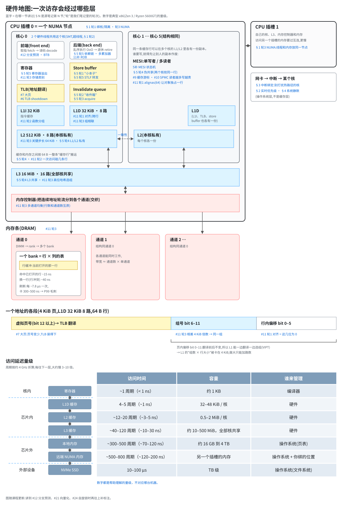

# 硬件地图

> 一张图把讲过的硬件层串起来：从寄存器、store buffer、各级缓存，到内存控制器和内存条。每个框上的蓝字是“在哪一节讲过”。
> 学新内容时对着它看：先在图上找到这一节讲的是哪一层，再看它和上下层怎么接。讲到新的硬件层就往图上补标注。
> 博客上的公开版是[速查页](https://jasper-aa64.github.io/zh/ref/cpu-memory/)（2026-10-08 起）：同一张图（标注用博客编号），加上各部件的数字（延迟、带宽、MLP、带宽需求，都是帮助理解的范围）和估算模型。本文件管“各层在哪些笔记里”，数字以速查页为准。

## 读（load）的路径

读一个变量，按图从上往下走：

1. **TLB** 把虚拟地址翻译成物理地址。同时 **L1D** 已经用地址的 bit 6–11 选好了组（图最下面那条地址分段）。TLB 分 L1 dTLB（64–96 项）和 STLB（1500–3000 项），4 KiB 页只盖几 MiB；没命中要 page walk，约多 15–30 ns，2 MiB 大页把覆盖范围放大 512 倍（11补 轮 3）。
2. L1D 命中，约 1 ns 结束。没命中，先在 L1D 的 **LFB**（line fill buffer，填充缓冲）里登记一项：“这条行已经去取，还没回来”。一个核有 12–24 项，同时在路上的缺失最多就这么多（11补）。然后问本核的 **L2**，再问全核共享的 **L3**。
3. L3 也没有，交给**内存控制器**，按地址选通道、bank、行。行缓冲命中约 14 ns，否则约 40 ns，加上一路上的开销，整体约 80–100 ns。
4. 拿回来的永远是一整条 **64 B 缓存行**，沿路放进各级缓存。一次走到内存约 80–120 ns，DRAM 本身只占约 1/3；硬件预取器（L1 的 next-line / IP-stride、L2 的 streamer）提前发请求，但通常不跨 4 KiB 页；另一个插槽的内存约 120–200 ns（11补 轮 3）。

写一个变量多两步：先进 **store buffer**（§5 轮 1），要写进 L1D 之前必须拿到这条行的独占权，别的核的副本要作废（**MESI**，5补）。别的核收到作废通知，先排进 **invalidate queue**（§5 轮 2）。行不在缓存里时先整条读回（**RFO**），改完被踢出时再写回，所以普通写一条行在总线上走两趟；**流式写**（non-temporal store）在 **WC 缓冲**（写合并缓冲，Intel 上与 LFB 共用）里凑满 64 B 直接写内存，只走一趟（11补 轮 2）。

## 取指令的路径（前端）

图上画的是数据那一侧。指令那一侧是**前端**：按“下一条指令的地址”从 **L1I** 取指，译码成 µop，重命名后进 ROB。旁边挂着**分支预测器**：**BTB** 记分支的目标，**RAS** 记函数返回地址，**间接目标预测器**管虚函数、函数指针和跳转表，方向预测器用计数器加全局历史猜“跳不跳”。猜错时 ROB 里猜错之后的指令全部作废，约 15–20 个周期（#12 轮 1）。

## 各层在哪些笔记里

| 层 | 笔记 |
|---|---|
| 核、SMT、NUMA | [01 CPU 亲和性与 NUMA](01-低延迟系统开发基础/01-CPU亲和性与NUMA架构.md) |
| 中断 → 核 | [03 中断绑定与核心隔离](01-低延迟系统开发基础/03-中断绑定与核心隔离.md) |
| 流水线、store buffer、invalidate queue、缓存行、伪共享 | [05 内存模型与缓存及流水线](01-低延迟系统开发基础/05-内存模型与缓存及流水线.md) |
| 缓存一致性（MESI） | [05补 MESI](01-低延迟系统开发基础/05-补-MESI缓存一致性状态机.md) |
| TLB、页、大页 | [07 大页内存](01-低延迟系统开发基础/07-大页内存.md) · [06 内存池](01-低延迟系统开发基础/06-内存池.md)（TLB shootdown） |
| 多核共享一条行的实战 | [09 lock-free queue](01-低延迟系统开发基础/09-lock-free-queue及micro-batching.md) · [10 SPMC](01-低延迟系统开发基础/10-spmc共享内存无锁队列应用.md) |
| L1D 内部（组相联：64 行 × 8 格） | [L1D 内部结构图](docs/l1d-sets.svg) · [11 轮 3〔补〕](01-低延迟系统开发基础/11-内存对齐与典型内存布局优化.md) |
| 内存条内部（通道 / rank / bank / 行缓冲） | [内存条内部结构图](docs/dram-geometry.svg) · [11 轮 3 第 4 节](01-低延迟系统开发基础/11-内存对齐与典型内存布局优化.md) |
| 框与框之间的路：延迟、带宽、在途请求数（ROB、LFB） | [11补 内存层级专题](01-低延迟系统开发基础/11-补-内存层级-延迟与带宽.md) |
| 对齐、布局、组相联、DRAM、通道 | [11 内存对齐与内存布局](01-低延迟系统开发基础/11-内存对齐与典型内存布局优化.md) |

图里的数字都是帮助理解的量级，不对应哪台机器。
